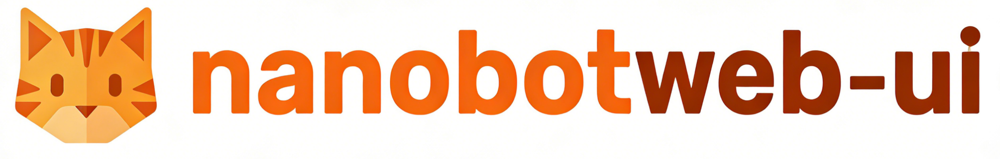
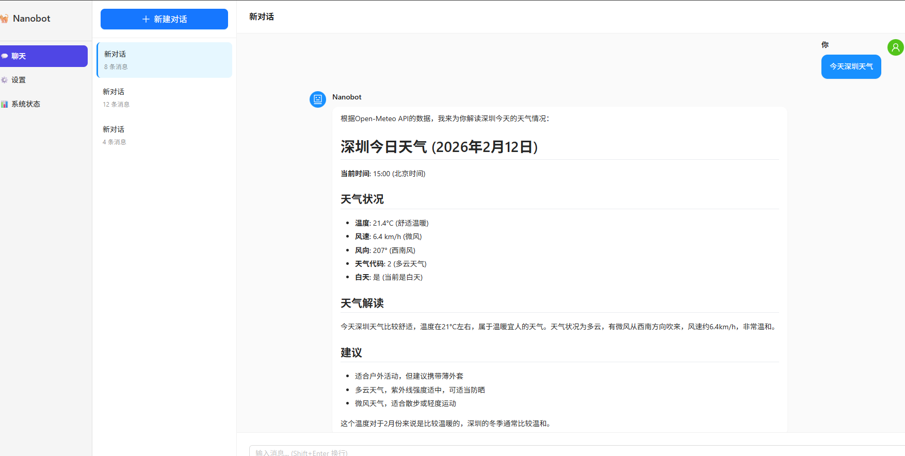
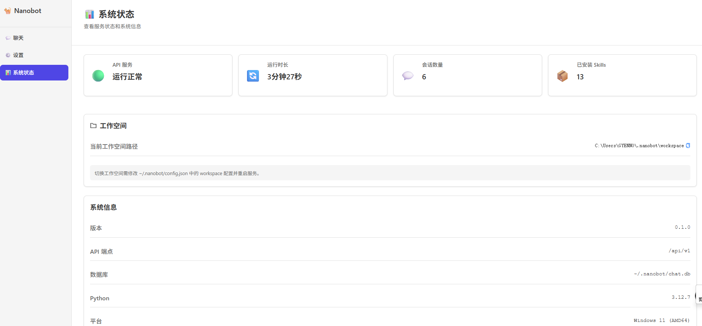
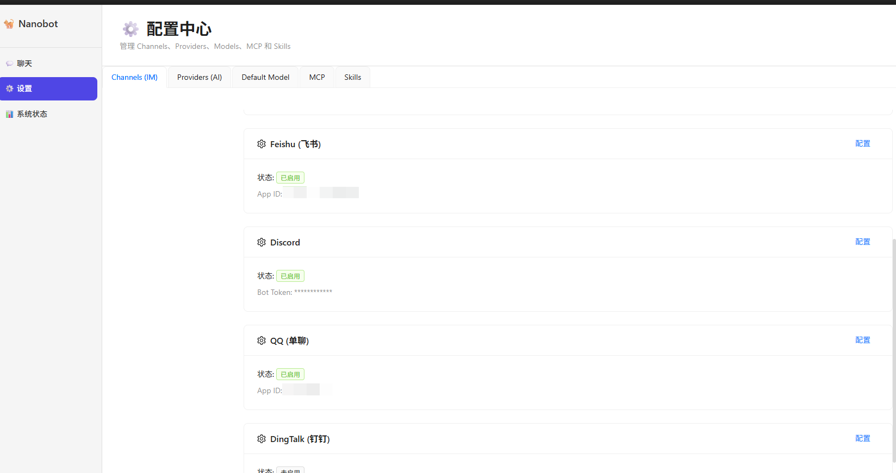
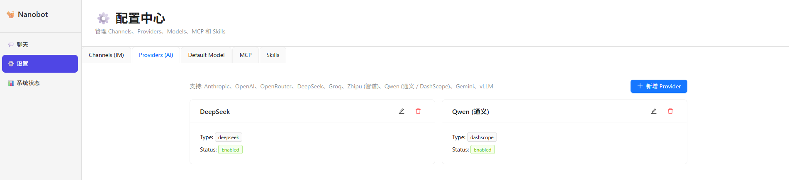
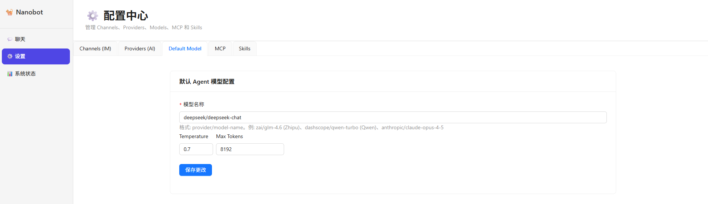
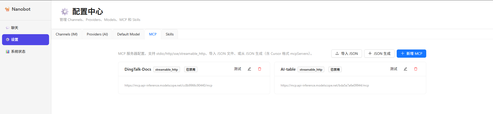
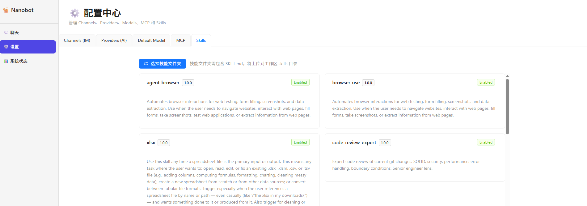

<div align="center">
  
  <h1>nanobot: Ultra-Lightweight Personal AI Assistant</h1>
  <p>
    
    
    <a href="https://github.com/HKUDS/nanobot"></a>
    <a href="./README.zh-CN.md"></a>
  </p>
</div>

---

<p align="center">
  <strong>Tribute to nanobot</strong><br>
  <em>This project is built upon <a href="https://github.com/HKUDS/nanobot">nanobot</a> for secondary development. nanobot was inspired by <a href="https://github.com/openclaw/openclaw">Clawdbot</a>, implementing complete Agent functionality with approximately 4000 lines of core code. Thanks to the nanobot community for the lightweight, readable, and extensible foundation.</em>
</p>

---

## 📢 What's New in This Fork

This fork extends nanobot with **Web UI**, **MCP support**, **additional channels** (Discord, QQ, DingTalk), **document/office skills**, **system monitoring**, and more.

---

## ✨ Features Overview

| Category | Features |
|----------|----------|
| **Web UI** | React + TypeScript SPA: Chat, Config (Channels/Providers/Models/MCP/Skills), System Status |
| **Channels** | Discord, QQ (qq-botpy), DingTalk (钉钉), plus original Telegram, WhatsApp, Feishu |
| **MCP** | Model Context Protocol integration — connect external tools via stdio/HTTP/SSE |
| **Skills** | `code-review-expert`, `docx`, `pdf`, `pptx`, `xlsx`, `skill-creator` |
| **Providers** | Zhipu (智谱), DashScope (通义千问), vLLM, OpenRouter, Anthropic, OpenAI, DeepSeek, Groq, Gemini |
| **System** | StatusRepository (SQLite), SystemStatusService (uptime, session count), centralized logging |

---

## 📸 Screenshots

### Chat
Multi-turn conversation with Nanobot, Markdown rendering, new sessions and history. Example shows weather query — Agent fetches real-time data via MCP tools and returns structured card results.

<p align="center">
  
</p>

### System Status
View service health, uptime, active session count, installed Skills, workspace path, and system environment info.

<p align="center">
  
</p>

### Config — Channels (IM)
Manage IM channel enablement and config — Feishu, Discord, QQ, DingTalk, Telegram, WhatsApp, and more.

<p align="center">
  
</p>

### Config — Providers (AI)
Manage AI model providers — DeepSeek, Qwen, Zhipu, OpenAI, Anthropic, OpenRouter, vLLM, Groq, Gemini, etc. Add, edit, or remove providers.

<p align="center">
  
</p>

### Config — Default Model
Set the default Agent model — model name (provider/model-name format), Temperature, Max Tokens, and other parameters.

<p align="center">
  
</p>

### Config — MCP
Manage Model Context Protocol servers — stdio, http, sse, streamable_http. Import/generate JSON or add new MCP services.

<p align="center">
  
</p>

### Config — Skills
Manage AI skills — select skill folders for upload to workspace, view installed skills (version, status, description), enable or disable.

<p align="center">
  
</p>

---

## 🚀 Quick Start

### Install

```bash
git clone https://github.com/HKUDS/nanobot.git
cd nanobot
pip install -e .
```

### Quick Launch

One-click startup — the script checks Python/Node.js, installs dependencies, builds the frontend, and starts the Web UI:

- **Windows:** Double-click `startup.bat` or run:
  ```batch
  startup.bat
  ```
- **Linux / macOS:** 
  ```bash
  chmod +x startup.sh
  ./startup.sh
  ```

Then open http://127.0.0.1:6788

### Web UI

```bash
# Build frontend (first time)
cd web-ui && npm install && npm run build && cd ..

# Start Web UI (backend + static files)
nanobot web-ui
```

Open http://127.0.0.1:6788 — Chat, Config, and System pages are available.

### CLI Chat

```bash
nanobot onboard   # Initialize config
# Edit ~/.nanobot/config.json with your API key
nanobot agent -m "Hello!"
```

---

## 🖥️ Web UI Details

- **Chat** — Create sessions, multi-turn conversations, Markdown rendering, session persistence
- **Config** — Manage Channels (IM), Providers, Models, MCP servers, Skills
- **System** — Health check, uptime, session count, system info, config export

---

## 📦 Optional Dependencies

```bash
# Feishu
pip install nanobot-ai[feishu]

# QQ
pip install nanobot-ai[qq]

# DingTalk
pip install nanobot-ai[dingtalk]

# MCP
pip install nanobot-ai[mcp]
```

---

## 📁 Project Structure (This Fork)

```
nanobot/
├── agent/          # Core agent (loop, context, memory, tools)
│   └── tools/      # mcp.py, filesystem, shell, registry...
├── channels/       # telegram, whatsapp, feishu, discord, qq, dingtalk
├── web/            # REST API server (api.py)
├── mcp/            # MCP loader
├── storage/        # StatusRepository (SQLite)
├── services/       # SystemStatusService
├── skills/         # code-review-expert, docx, pdf, pptx, xlsx, skill-creator...
├── config/         # Extended schema (Discord, QQ, DingTalk, MCP)
└── cli/            # web-ui command, status, etc.
web-ui/             # React SPA (Chat, Config, System)
```

---

## 🤝 Credits

- **[nanobot](https://github.com/HKUDS/nanobot)** — The base project this fork builds upon
- **nanobot contributors** — For the lightweight, research-friendly design

---

<p align="center">
  <em>Thanks for visiting ✨ nanobot!</em>
</p>
