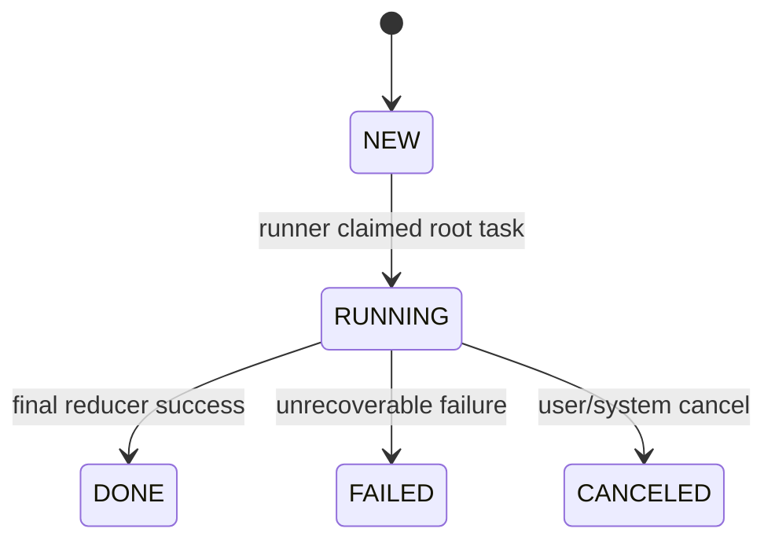
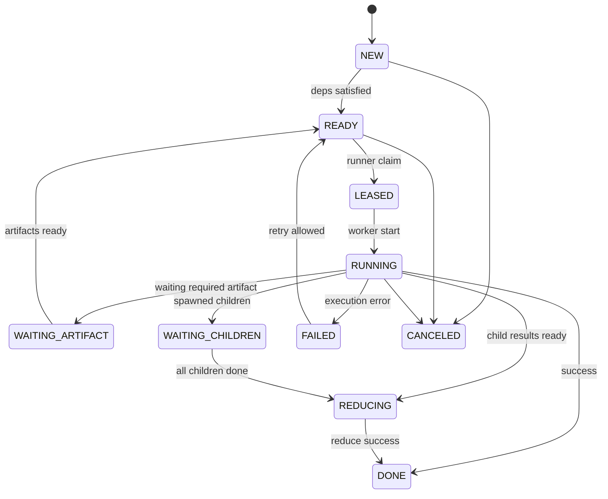
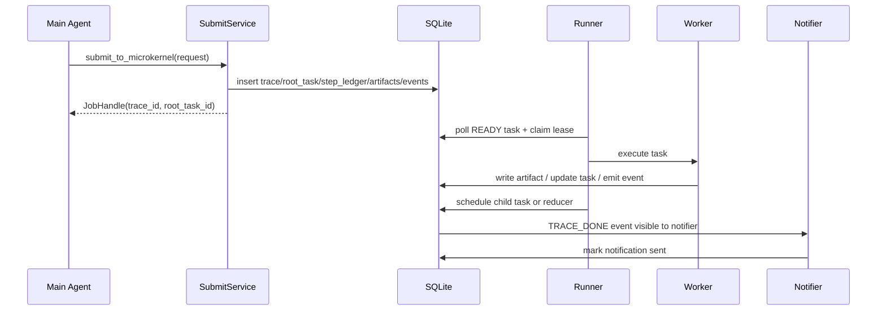

# Nanobot × AgentLoop 微内核修订版技术设计（Python + SQLite）

## 1. 文档目的

本文档给出一版**可直接开工**的修订方案，用于在 **nanobot 二次开发**基础上整合 **agentloop + 微内核**。

这版方案明确收紧为：

- **产品语义**：主 Agent 触发**异步升级**到微内核执行，不再混用“无缝继续执行”的同步 handoff 语义
- **技术栈**：仅使用 **Python + SQLite**
- **执行模型**：**控制流为任务树，数据依赖为 artifact DAG**
- **调度模式**：**DB 驱动的持久化 runner**
- **通知模型**：**单写者 notifier**
- **能力模型**：**能力兼容 + 统一工具后端（Tool Gateway）**

---

## 2. 本次修订要解决的问题

结合前面的审查，本版优先修正以下问题：

### P0
1. **同步 handoff 和异步后台任务语义混淆**
2. **`asyncio.create_task(...)` 不能作为可靠后台执行机制**
3. **`initial_artifacts` 模型不稳定，存在覆盖和身份不清问题**

### P1
4. **`attempted_steps` 对 planner 可读信息不足**
5. **微内核直接复用主 Agent Tool 包装层，边界不清**
6. **升级阈值过于粗糙**
7. **完成通知存在多写者竞态**
8. **SQLite 并发/租约/恢复细节未定义**

---

## 3. 修订后的核心结论

### 3.1 统一产品语义：只保留“异步升级”
主 Agent 在当前回合内做如下动作：

1. 判断复杂度达到升级条件
2. 调用 `submit_to_microkernel(...)`
3. 返回一条“已进入深度处理”的结果给用户
4. 微内核后台执行
5. 完成后由 `notifier` 统一投递结果

**不再在同一个接口里同时承载同步接管和后台提交两种语义。**

---

## 4. 总体架构

```text
+----------------------+
|      Main Agent      |
|----------------------|
| dialog loop          |
| tool steps           |
| escalation judge     |
+----------+-----------+
           |
           | submit_to_microkernel()
           v
+----------------------+
|   SQLite DB Layer    |
|----------------------|
| traces               |
| tasks                |
| artifacts            |
| task_artifact_deps   |
| step_ledger          |
| events               |
| notifications        |
+----------+-----------+
           |
           | poll + lease
           v
+----------------------+
|  Kernel Runner(s)    |
|----------------------|
| event loop           |
| scheduler            |
| task dispatcher      |
| reducer              |
| retry/cancel         |
+----+-------------+---+
     |             |
     |             |
     v             v
+---------+   +-----------+
| Agent   |   | Tool      |
| Worker  |   | Gateway   |
+---------+   +-----------+
                    |
                    v
             Existing tool backend

+----------------------+
|      Notifier        |
|----------------------|
| single writer        |
| project final result |
| push bus / session   |
+----------------------+
```

---

## 5. 关键设计原则

### 5.1 控制流是树
- 谁创建谁
- 谁取消谁
- 谁对子任务负责
- budget 怎么继承

这些都走任务树。

### 5.2 数据依赖是图
- 结果不在 task 间直接传文本
- 通过 artifact 引用共享
- 多个 task 可以消费同一 artifact

### 5.3 task 不直接互发消息
task 之间只通过：
- 微内核调度
- artifact store
- reducer 归并

### 5.4 微内核不直接写用户对话消息
微内核只写：
- trace/task/artifact/event/final_result

由 notifier 统一投递用户可见消息。

---

## 6. 统一接口定义

### 6.1 主 Agent -> 微内核提交接口

```python
from dataclasses import dataclass, field
from typing import Any, Literal

StepStatus = Literal["DONE", "FAILED", "PARTIAL", "TIMEOUT", "CANCELED"]
ArtifactStatus = Literal["READY", "PARTIAL", "INVALID"]

@dataclass
class StepLedger:
    step_id: str
    name: str
    args_json: dict[str, Any]
    status: StepStatus
    artifact_refs: list[str] = field(default_factory=list)
    error_code: str | None = None
    error_message: str | None = None
    idempotency_key: str | None = None
    started_at_ms: int | None = None
    finished_at_ms: int | None = None

@dataclass
class ArtifactSeed:
    artifact_id: str
    artifact_type: str
    key: str
    payload_json: dict[str, Any]
    content_hash: str
    status: ArtifactStatus = "READY"
    is_partial: bool = False
    source: str = "main_agent"
    dedupe_key: str | None = None

@dataclass
class OriginRef:
    session_id: str
    channel: str
    user_id: str | None = None
    message_id: str | None = None

@dataclass
class SubmitRequest:
    goal: str
    origin: OriginRef
    attempted_steps: list[StepLedger]
    initial_artifacts: list[ArtifactSeed]
    metadata: dict[str, Any] = field(default_factory=dict)
```

### 6.2 返回句柄

```python
@dataclass
class JobHandle:
    trace_id: str
    root_task_id: str
    status: str
```

---

## 7. 数据库模型（SQLite）

> 建议启动时执行：
>
> - `PRAGMA journal_mode=WAL;`
> - `PRAGMA synchronous=NORMAL;`
> - `PRAGMA foreign_keys=ON;`
> - `PRAGMA busy_timeout=5000;`

### 7.1 traces

```sql
CREATE TABLE IF NOT EXISTS traces (
    trace_id TEXT PRIMARY KEY,
    session_id TEXT NOT NULL,
    channel TEXT NOT NULL,
    goal TEXT NOT NULL,
    status TEXT NOT NULL,
    submit_mode TEXT NOT NULL DEFAULT 'ASYNC',
    escalation_reason TEXT,
    complexity_score REAL NOT NULL DEFAULT 0,
    max_spawn_depth INTEGER NOT NULL DEFAULT 3,
    max_parallelism INTEGER NOT NULL DEFAULT 4,
    token_budget INTEGER NOT NULL DEFAULT 0,
    cost_budget REAL NOT NULL DEFAULT 0,
    created_at_ms INTEGER NOT NULL,
    updated_at_ms INTEGER NOT NULL,
    finished_at_ms INTEGER
);
```

### 7.2 tasks

```sql
CREATE TABLE IF NOT EXISTS tasks (
    task_id TEXT PRIMARY KEY,
    trace_id TEXT NOT NULL,
    parent_task_id TEXT,
    depth INTEGER NOT NULL DEFAULT 0,
    capability_name TEXT NOT NULL,
    capability_kind TEXT NOT NULL,
    intent TEXT NOT NULL,
    state TEXT NOT NULL,
    priority INTEGER NOT NULL DEFAULT 0,
    input_json TEXT NOT NULL DEFAULT '{}',
    output_artifact_id TEXT,
    required_children INTEGER NOT NULL DEFAULT 0,
    completed_children INTEGER NOT NULL DEFAULT 0,
    retry_count INTEGER NOT NULL DEFAULT 0,
    max_retries INTEGER NOT NULL DEFAULT 2,
    lease_owner TEXT,
    lease_until_ms INTEGER,
    idempotency_key TEXT,
    error_code TEXT,
    error_message TEXT,
    created_at_ms INTEGER NOT NULL,
    updated_at_ms INTEGER NOT NULL,
    started_at_ms INTEGER,
    finished_at_ms INTEGER,
    FOREIGN KEY(trace_id) REFERENCES traces(trace_id)
);
```

索引：

```sql
CREATE INDEX IF NOT EXISTS idx_tasks_trace_state ON tasks(trace_id, state);
CREATE INDEX IF NOT EXISTS idx_tasks_parent ON tasks(parent_task_id);
CREATE INDEX IF NOT EXISTS idx_tasks_lease ON tasks(state, lease_until_ms);
CREATE INDEX IF NOT EXISTS idx_tasks_priority ON tasks(state, priority DESC, created_at_ms ASC);
```

### 7.3 artifacts

```sql
CREATE TABLE IF NOT EXISTS artifacts (
    artifact_id TEXT PRIMARY KEY,
    trace_id TEXT NOT NULL,
    producer_task_id TEXT,
    artifact_type TEXT NOT NULL,
    artifact_key TEXT NOT NULL,
    status TEXT NOT NULL,
    version INTEGER NOT NULL DEFAULT 1,
    payload_json TEXT NOT NULL,
    content_hash TEXT NOT NULL,
    dedupe_key TEXT,
    source TEXT NOT NULL,
    is_partial INTEGER NOT NULL DEFAULT 0,
    validation_status TEXT NOT NULL DEFAULT 'VALID',
    created_at_ms INTEGER NOT NULL,
    updated_at_ms INTEGER NOT NULL,
    FOREIGN KEY(trace_id) REFERENCES traces(trace_id)
);
```

索引：

```sql
CREATE UNIQUE INDEX IF NOT EXISTS idx_artifacts_trace_key_version
ON artifacts(trace_id, artifact_key, version);

CREATE INDEX IF NOT EXISTS idx_artifacts_trace_type
ON artifacts(trace_id, artifact_type);

CREATE INDEX IF NOT EXISTS idx_artifacts_dedupe
ON artifacts(trace_id, dedupe_key);
```

### 7.4 task_artifact_deps

```sql
CREATE TABLE IF NOT EXISTS task_artifact_deps (
    id INTEGER PRIMARY KEY AUTOINCREMENT,
    task_id TEXT NOT NULL,
    artifact_id TEXT NOT NULL,
    mode TEXT NOT NULL,
    required INTEGER NOT NULL DEFAULT 1,
    ready INTEGER NOT NULL DEFAULT 0,
    created_at_ms INTEGER NOT NULL,
    UNIQUE(task_id, artifact_id, mode),
    FOREIGN KEY(task_id) REFERENCES tasks(task_id),
    FOREIGN KEY(artifact_id) REFERENCES artifacts(artifact_id)
);
```

### 7.5 step_ledger

```sql
CREATE TABLE IF NOT EXISTS step_ledger (
    step_id TEXT PRIMARY KEY,
    trace_id TEXT NOT NULL,
    task_id TEXT,
    actor TEXT NOT NULL,
    name TEXT NOT NULL,
    args_json TEXT NOT NULL,
    status TEXT NOT NULL,
    artifact_refs_json TEXT NOT NULL DEFAULT '[]',
    error_code TEXT,
    error_message TEXT,
    idempotency_key TEXT,
    started_at_ms INTEGER,
    finished_at_ms INTEGER,
    created_at_ms INTEGER NOT NULL,
    FOREIGN KEY(trace_id) REFERENCES traces(trace_id)
);
```

### 7.6 events

```sql
CREATE TABLE IF NOT EXISTS events (
    event_id TEXT PRIMARY KEY,
    trace_id TEXT NOT NULL,
    task_id TEXT,
    event_type TEXT NOT NULL,
    payload_json TEXT NOT NULL DEFAULT '{}',
    created_at_ms INTEGER NOT NULL,
    processed INTEGER NOT NULL DEFAULT 0,
    FOREIGN KEY(trace_id) REFERENCES traces(trace_id)
);
```

### 7.7 notifications

```sql
CREATE TABLE IF NOT EXISTS notifications (
    notification_id TEXT PRIMARY KEY,
    trace_id TEXT NOT NULL,
    kind TEXT NOT NULL,
    status TEXT NOT NULL DEFAULT 'PENDING',
    payload_json TEXT NOT NULL,
    created_at_ms INTEGER NOT NULL,
    updated_at_ms INTEGER NOT NULL,
    FOREIGN KEY(trace_id) REFERENCES traces(trace_id)
);
```

---

## 8. 状态机

### 8.1 trace 状态机



### 8.2 task 状态机



---

## 9. 提交流程



---

## 10. 提交服务实现建议

### 10.1 提交时做的事
`submit_to_microkernel()` 只做：

1. 创建 trace
2. 创建 root task
3. 写入 main agent 的 step ledger
4. 写入 initial artifacts
5. 建立 root task 依赖
6. 发出 `TRACE_SUBMITTED` 事件
7. 返回 `JobHandle`

**不在这里做任何后台执行。**

### 10.2 示例代码

```python
import json
import sqlite3
import time
import uuid

def now_ms() -> int:
    return int(time.time() * 1000)

def new_id(prefix: str) -> str:
    return f"{prefix}_{uuid.uuid4().hex[:16]}"

class SubmitService:
    def __init__(self, conn: sqlite3.Connection):
        self.conn = conn

    def submit_to_microkernel(self, req) -> dict:
        ts = now_ms()
        trace_id = new_id("tr")
        root_task_id = new_id("task")

        with self.conn:
            self.conn.execute("""
                INSERT INTO traces (
                    trace_id, session_id, channel, goal, status,
                    submit_mode, complexity_score, created_at_ms, updated_at_ms
                ) VALUES (?, ?, ?, ?, 'NEW', 'ASYNC', ?, ?, ?)
            """, (
                trace_id, req.origin.session_id, req.origin.channel,
                req.goal, req.metadata.get("complexity_score", 0), ts, ts
            ))

            self.conn.execute("""
                INSERT INTO tasks (
                    task_id, trace_id, parent_task_id, depth,
                    capability_name, capability_kind, intent, state,
                    input_json, created_at_ms, updated_at_ms
                ) VALUES (?, ?, NULL, 0, 'planner', 'planner', 'root_plan', 'READY', ?, ?, ?)
            """, (
                root_task_id, trace_id, json.dumps({"goal": req.goal}), ts, ts
            ))

            for step in req.attempted_steps:
                self.conn.execute("""
                    INSERT INTO step_ledger (
                        step_id, trace_id, actor, name, args_json, status,
                        artifact_refs_json, error_code, error_message,
                        idempotency_key, started_at_ms, finished_at_ms, created_at_ms
                    ) VALUES (?, ?, 'main_agent', ?, ?, ?, ?, ?, ?, ?, ?, ?, ?)
                """, (
                    step.step_id, trace_id, step.name, json.dumps(step.args_json),
                    step.status, json.dumps(step.artifact_refs), step.error_code,
                    step.error_message, step.idempotency_key,
                    step.started_at_ms, step.finished_at_ms, ts
                ))

            for art in req.initial_artifacts:
                self.conn.execute("""
                    INSERT INTO artifacts (
                        artifact_id, trace_id, producer_task_id, artifact_type,
                        artifact_key, status, version, payload_json,
                        content_hash, dedupe_key, source, is_partial,
                        validation_status, created_at_ms, updated_at_ms
                    ) VALUES (?, ?, NULL, ?, ?, ?, 1, ?, ?, ?, ?, ?, 'VALID', ?, ?)
                """, (
                    art.artifact_id, trace_id, art.artifact_type, art.key,
                    art.status, json.dumps(art.payload_json), art.content_hash,
                    art.dedupe_key, art.source, 1 if art.is_partial else 0, ts, ts
                ))

            event_id = new_id("evt")
            self.conn.execute("""
                INSERT INTO events (event_id, trace_id, task_id, event_type, payload_json, created_at_ms)
                VALUES (?, ?, ?, 'TRACE_SUBMITTED', '{}', ?)
            """, (event_id, trace_id, root_task_id, ts))

        return {
            "trace_id": trace_id,
            "root_task_id": root_task_id,
            "status": "NEW"
        }
```

---

## 11. Runner 设计

### 11.1 原则
- runner 是**独立轮询者**
- 通过 `lease_owner + lease_until_ms` 抢占任务
- 执行前 claim
- 执行后提交结果
- lease 超时可恢复

### 11.2 认领规则
候选任务：
- `state = READY`
- 或 `state = LEASED AND lease_until_ms < now`

claim 时要求原子更新：
- 只有当前仍满足可认领条件才成功

### 11.3 示例代码

```python
import socket
import json

RUNNER_ID = f"runner:{socket.gethostname()}"

class TaskRunner:
    def __init__(self, conn: sqlite3.Connection, registry, reducer):
        self.conn = conn
        self.registry = registry
        self.reducer = reducer

    def claim_next_task(self, lease_ms: int = 15000) -> dict | None:
        now = now_ms()

        row = self.conn.execute("""
            SELECT task_id, trace_id, capability_name, capability_kind, intent, input_json
            FROM tasks
            WHERE state IN ('READY', 'LEASED')
              AND (state = 'READY' OR lease_until_ms < ?)
            ORDER BY priority DESC, created_at_ms ASC
            LIMIT 1
        """, (now,)).fetchone()

        if not row:
            return None

        task_id = row[0]
        lease_until = now + lease_ms

        with self.conn:
            cur = self.conn.execute("""
                UPDATE tasks
                SET state = 'LEASED',
                    lease_owner = ?,
                    lease_until_ms = ?,
                    updated_at_ms = ?
                WHERE task_id = ?
                  AND state IN ('READY', 'LEASED')
                  AND (state = 'READY' OR lease_until_ms < ?)
            """, (RUNNER_ID, lease_until, now, task_id, now))

        if cur.rowcount != 1:
            return None

        return {
            "task_id": row[0],
            "trace_id": row[1],
            "capability_name": row[2],
            "capability_kind": row[3],
            "intent": row[4],
            "input": json.loads(row[5]),
        }

    def run_once(self):
        task = self.claim_next_task()
        if not task:
            return False

        self.mark_running(task["task_id"])
        try:
            handler = self.registry.get(task["capability_name"])
            result = handler.invoke(task, self.conn)
            self.handle_result(task, result)
        except Exception as e:
            self.handle_failure(task, "UNHANDLED", str(e))
        return True

    def mark_running(self, task_id: str):
        with self.conn:
            self.conn.execute("""
                UPDATE tasks
                SET state = 'RUNNING',
                    started_at_ms = COALESCE(started_at_ms, ?),
                    updated_at_ms = ?
                WHERE task_id = ?
            """, (now_ms(), now_ms(), task_id))
```

---

## 12. Capability 模型

### 12.1 Capability 只统一执行协议

```python
class Capability:
    name: str
    kind: str  # planner / agent / tool / reducer

    def invoke(self, task: dict, conn) -> dict:
        raise NotImplementedError
```

### 12.2 不直接复用对话层 Tool 类
微内核与主 Agent 共享的是**执行后端**，不是最上层 prompt / session 包装。

### Tool Gateway

```python
class ToolGateway:
    def __init__(self, tool_backend_registry):
        self.tool_backend_registry = tool_backend_registry

    def call(self, tool_name: str, normalized_args: dict, *,
             actor: str, trace_id: str, task_id: str,
             side_effect_policy: str = "read_only") -> dict:
        backend = self.tool_backend_registry[tool_name]
        return backend.execute(
            normalized_args,
            actor=actor,
            trace_id=trace_id,
            task_id=task_id,
            side_effect_policy=side_effect_policy,
        )
```

这样可以保证：
- 主 Agent 和微内核共用后端能力
- 但不会共用会话层副作用
- 方便审计和幂等

---

## 13. Planner 输入不再依赖 preview，而依赖 ledger + artifact refs

Planner 输入包含：
- 当前用户目标
- 已执行 step ledger
- 可用 artifact 列表
- 已失败步骤与错误码
- 当前预算信息

### Planner 示例输出

```json
{
  "spawn": [
    {
      "task_id": "task_search_1",
      "capability_name": "tool_search",
      "capability_kind": "tool",
      "intent": "retrieve_docs",
      "input": {"query": "agentloop microkernel patterns"}
    },
    {
      "task_id": "task_arch_draft",
      "capability_name": "arch_agent",
      "capability_kind": "agent",
      "intent": "draft_architecture",
      "input": {"goal": "draft solution from current evidence"}
    }
  ],
  "reduce_when": "children_done"
}
```

---

## 14. Artifact 模型

### 14.1 为什么必须从 dict 改成 list

错误模型：

```python
{
  "doc_content_v1": {...},
  "search_result_v1": [...]
}
```

问题：
- 同类型多份产物覆盖
- 身份不清
- 难 dedupe
- 难增量更新

正确模型：

```python
[
  {
    "artifact_id": "ar_001",
    "artifact_type": "doc_content_v1",
    "key": "read_file:/docs/a.md",
    "payload_json": {"path": "/docs/a.md", "content": "..."},
    "content_hash": "sha256:xxx",
    "status": "READY",
    "source": "main_agent"
  },
  {
    "artifact_id": "ar_002",
    "artifact_type": "search_result_v1",
    "key": "search:agentloop",
    "payload_json": {"items": [...]},
    "content_hash": "sha256:yyy",
    "status": "READY",
    "source": "main_agent"
  }
]
```

### 14.2 artifact 校验
写入前必须过：
- schema/type 校验
- payload size 校验
- hash 校验
- `is_partial` 标记
- `validation_status`

---

## 15. 依赖满足与唤醒

某个 artifact 写入后，需要：

1. 插入 artifact
2. 找到依赖它的 task
3. 更新 `task_artifact_deps.ready = 1`
4. 检查该 task 所有 required deps 是否就绪
5. 若全部就绪，将 task 从 `WAITING_ARTIFACT` -> `READY`

### 示例 SQL

```sql
UPDATE task_artifact_deps
SET ready = 1
WHERE artifact_id = :artifact_id
  AND mode = 'READ';

UPDATE tasks
SET state = 'READY',
    updated_at_ms = :now_ms
WHERE task_id IN (
    SELECT d.task_id
    FROM task_artifact_deps d
    GROUP BY d.task_id
    HAVING SUM(CASE WHEN d.required = 1 AND d.ready = 0 THEN 1 ELSE 0 END) = 0
)
AND state = 'WAITING_ARTIFACT';
```

---

## 16. 子任务、barrier、reducer

### 16.1 控制树中的 barrier
父任务 spawn children 后：
- `required_children = N`
- `completed_children = 0`
- 父任务状态置为 `WAITING_CHILDREN`

子任务完成时：
- `completed_children += 1`
- 若达到 `required_children`，父任务进入 `REDUCING`

### 更新 SQL

```sql
UPDATE tasks
SET completed_children = completed_children + 1,
    updated_at_ms = :now_ms
WHERE task_id = :parent_task_id;

UPDATE tasks
SET state = 'REDUCING',
    updated_at_ms = :now_ms
WHERE task_id = :parent_task_id
  AND completed_children >= required_children
  AND state = 'WAITING_CHILDREN';
```

### 16.2 reducer 输入
reducer 不读聊天历史，只读：
- 子任务 output artifact refs
- 局部 evidence bundle
- planner 输出
- budget / retry 信息

---

## 17. 升级阈值从“次数”改成“复杂度分数”

### 示例规则

```python
def calc_escalation_score(ctx) -> int:
    return (
        ctx.tool_calls * 1
        + ctx.unique_tools * 2
        + ctx.repeated_failures * 3
        + ctx.spawn_requests * 4
        + ctx.timeout_count * 5
        + (3 if ctx.has_partial_artifacts and not ctx.converging else 0)
    )
```

### 建议阈值
- `score < 6`：继续主 Agent
- `6 <= score < 10`：提示谨慎升级
- `score >= 10`：自动升级

---

## 18. 通知模型：单写者 notifier

### 18.1 原则
微内核**不直接写 assistant message**。

微内核只做：
- 更新 trace 状态
- 写 final artifact
- 插入 `notifications` 记录

`notifier` 负责：
- 读取 `PENDING` notification
- 生成用户可见摘要
- 按 channel 投递
- 成功后标记 `SENT`

### 18.2 好处
- 避免重复写 session
- 避免 bus 和 session 双写
- 避免非 Web 渠道重复触发一轮主 Agent 总结

### 18.3 示例代码

```python
class Notifier:
    def __init__(self, conn, projector, channel_sender):
        self.conn = conn
        self.projector = projector
        self.channel_sender = channel_sender

    def send_pending_once(self):
        row = self.conn.execute("""
            SELECT notification_id, trace_id, kind, payload_json
            FROM notifications
            WHERE status = 'PENDING'
            ORDER BY created_at_ms ASC
            LIMIT 1
        """).fetchone()

        if not row:
            return False

        notification_id, trace_id, kind, payload_json = row
        message = self.projector.render(trace_id, kind, payload_json)
        self.channel_sender.send(message)

        with self.conn:
            self.conn.execute("""
                UPDATE notifications
                SET status = 'SENT', updated_at_ms = ?
                WHERE notification_id = ?
            """, (now_ms(), notification_id))
        return True
```

---

## 19. 失败、重试、取消

### 19.1 重试策略
只对以下错误允许重试：
- 暂时性工具错误
- lease 过期中断
- 下游资源短暂不可用

不重试：
- schema 校验错误
- 参数错误
- 权限错误
- 业务拒绝

### 示例

```python
RETRYABLE = {"TOOL_TEMP_ERROR", "LEASE_EXPIRED", "TIMEOUT"}

def should_retry(task_row) -> bool:
    return (
        task_row["error_code"] in RETRYABLE
        and task_row["retry_count"] < task_row["max_retries"]
    )
```

### 19.2 取消
- 用户取消 trace -> 整棵控制子树取消
- task 被取消 -> 不再允许新子任务 spawn
- 已完成 artifact 不删除，仅标记 trace canceled

### SQL

```sql
UPDATE tasks
SET state = 'CANCELED',
    updated_at_ms = :now_ms
WHERE trace_id = :trace_id
  AND state IN ('NEW', 'READY', 'LEASED', 'RUNNING', 'WAITING_ARTIFACT', 'WAITING_CHILDREN', 'REDUCING');

UPDATE traces
SET status = 'CANCELED',
    updated_at_ms = :now_ms,
    finished_at_ms = :now_ms
WHERE trace_id = :trace_id;
```

---

## 20. 递归升级保护

必须加三条硬规则：

1. **同一 trace 只允许一次主链路升级**
2. **微内核内部禁止再次调用 `submit_to_microkernel`**
3. **spawn depth 超过 `max_spawn_depth` 时拒绝**

### 示例校验

```python
def validate_spawn(trace, parent_task, new_depth):
    if trace["submit_mode"] != "ASYNC":
        raise ValueError("invalid trace submit mode")
    if new_depth > trace["max_spawn_depth"]:
        raise ValueError("spawn depth exceeded")
```

---

## 21. SQLite 运行约束

### 21.1 连接建议
- 每个 worker / runner 使用独立连接
- 打开 WAL
- 短事务
- 先 claim 再执行
- 不把长时间工具调用包在事务里

### 21.2 初始化

```python
def open_db(path: str) -> sqlite3.Connection:
    conn = sqlite3.connect(path, check_same_thread=False)
    conn.execute("PRAGMA journal_mode=WAL;")
    conn.execute("PRAGMA synchronous=NORMAL;")
    conn.execute("PRAGMA foreign_keys=ON;")
    conn.execute("PRAGMA busy_timeout=5000;")
    return conn
```

---

## 22. 最小目录结构建议

```text
nanobot_agentloop/
├─ app/
│  ├─ db.py
│  ├─ models.py
│  ├─ submit_service.py
│  ├─ runner.py
│  ├─ scheduler.py
│  ├─ reducer.py
│  ├─ notifier.py
│  ├─ tool_gateway.py
│  ├─ capabilities/
│  │  ├─ planner.py
│  │  ├─ arch_agent.py
│  │  ├─ tool_search.py
│  │  └─ final_reducer.py
│  └─ migrations/
│     └─ 001_init.sql
├─ tests/
│  ├─ test_submit.py
│  ├─ test_claim.py
│  ├─ test_artifact_ready.py
│  ├─ test_retry.py
│  └─ test_notifier.py
└─ main.py
```

---

## 23. 典型执行案例

用户：“继续分析并完善 agentloop 微内核方案。”

### 23.1 主 Agent 已做过的步骤
- `read_file(design.md)` 成功
- `list_dir(/docs)` 成功
- `spawn_subagent(arch-review)` 部分成功

这些会写入 `step_ledger`。

### 23.2 main agent 产出的 initial artifacts
- `doc_content_v1`
- `dir_listing_v1`
- `review_notes_v1`

### 23.3 升级后任务树

```text
RootPlan
├─ RetrieveEvidence
│  ├─ SearchDocs
│  └─ ReadSpec
├─ DraftArchitecture
└─ CriticReview
```

### 23.4 数据依赖
- `DraftArchitecture` 读取 `review_notes_v1 + evidence_bundle_v1`
- `CriticReview` 读取 `draft_architecture_v1 + evidence_bundle_v1`

### 23.5 完成
- `final_reducer` 生成 `final_answer_v1`
- 插入 `notifications(FINAL_RESULT)`
- `notifier` 统一投递

---

## 24. 开发顺序

### Phase 1：先打通最小闭环
1. SQLite schema
2. `SubmitService`
3. `TaskRunner.claim_next_task()`
4. 一个 `planner` capability
5. 一个 `tool` capability
6. 一个 `reducer`
7. `notifier`

### Phase 2：补齐可靠性
1. lease 恢复
2. retry / cancel
3. artifact 校验
4. dependency ready 唤醒
5. trace done / failed 收口

### Phase 3：补齐复杂度策略
1. escalation score
2. budget 管理
3. 最大并发
4. spawn depth
5. dedupe / idempotency

---

## 25. 测试清单

### 25.1 单元测试
- submit 后 trace/task/artifact/event 是否正确落库
- READY task 是否只能被一个 runner claim
- artifact 写入后 WAITING_ARTIFACT task 是否被正确唤醒
- child 全完成后父任务是否进入 REDUCING
- retry 计数与状态流转是否正确
- notifier 是否只发送一次

### 25.2 集成测试
- 主 Agent 升级 -> 微内核完成 -> 通知发送
- runner 崩溃后 lease 过期恢复
- 多 runner 并发 claim 不重复执行
- cancel trace 后所有活跃 task 是否收敛

### 25.3 故障测试
- SQLite busy
- tool timeout
- reducer 抛异常
- artifact schema invalid
- notifier 发送失败后重试

---

## 26. 本版方案与旧版的明确差异

| 项目 | 旧版 | 修订版 |
|---|---|---|
| 升级语义 | 同时混合同步 handoff / 异步执行 | 只保留异步升级 |
| 后台执行 | `asyncio.create_task(...)` | DB 驱动 runner |
| initial_artifacts | dict / 类型覆盖 | 标准化 ArtifactSeed 列表 |
| attempted_steps | preview 导向 | StepLedger + artifact refs |
| Tool 复用 | 直接复用 Tool 包装层 | Tool Gateway 共享执行后端 |
| 通知 | kernel / session / bus 多写 | notifier 单写者 |
| 控制拓扑 | 含混 | 任务树 |
| 数据依赖 | 含混 | artifact DAG |
| 恢复 | 不可靠 | lease + poll + retry |

---

## 27. 建议的第一版范围控制

为了让项目尽快落地，v1 不要做这些：

- 不做完整 DAG 调度器
- 不做复杂优先级学习
- 不做流式 partial token 聚合
- 不做多数据库
- 不做跨进程消息总线

v1 只把下面四件事跑稳：
1. 异步升级
2. DB 持久化执行
3. artifact 共享
4. 单写者通知

---

## 28. 最终结论

这版修订后的方案，适合作为 **nanobot × agentloop 微内核** 的第一阶段落地实现。

它的关键价值在于：

- **把原来语义混杂的“升级”收敛成一个可靠的异步执行模型**
- **把任务控制与结果共享解耦：控制树 + artifact DAG**
- **把 demo 级 `create_task` 改成可恢复的 SQLite 持久化 runner**
- **把通知统一到单写者，避免 session / bus / inbound 竞态**
- **给主 Agent 和微内核建立清晰边界：能力兼容，但不共享对话层副作用**

如果按本文档实施，开发团队可以直接开始：
- 建表
- 写 submit service
- 写 runner claim 逻辑
- 实现 planner/tool/reducer 三类 capability
- 接上 notifier
- 做第一轮集成测试
