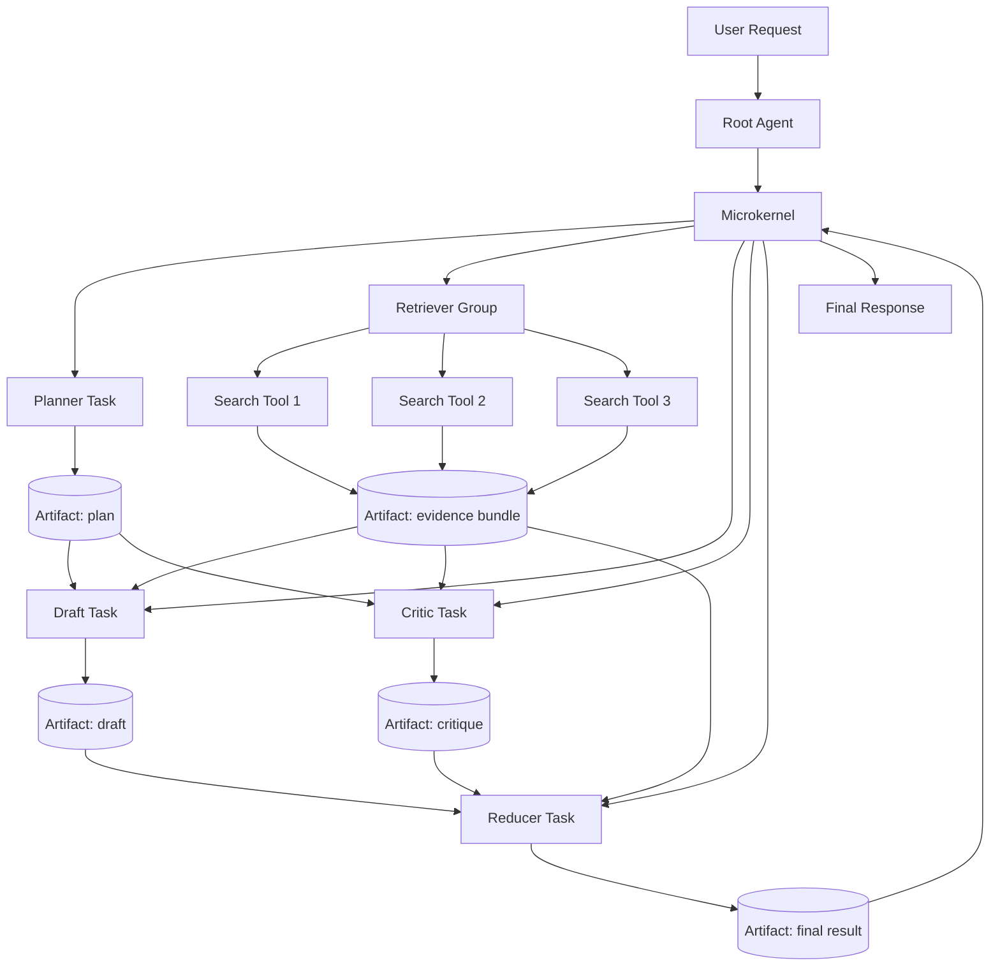
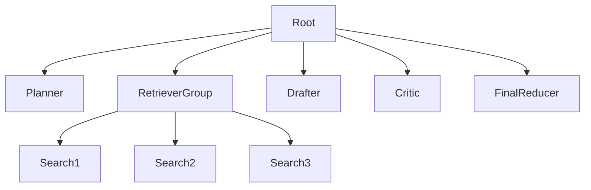
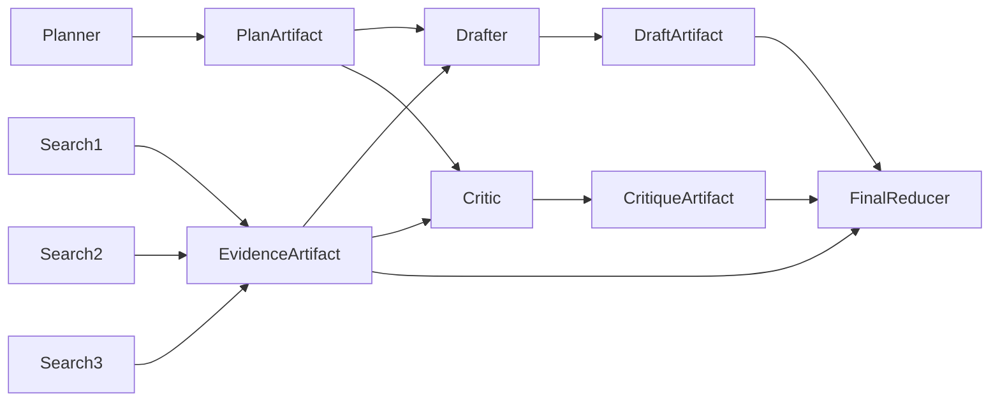
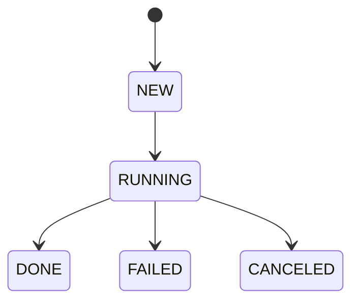
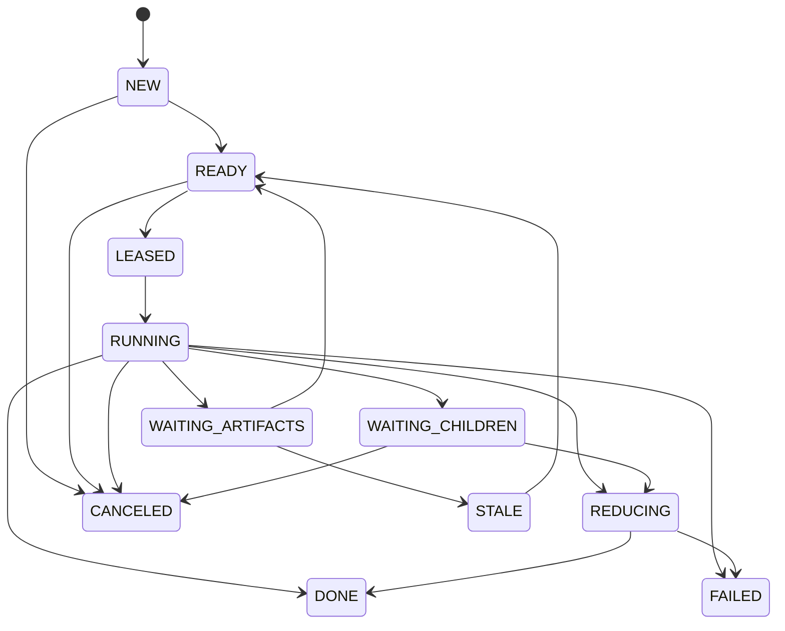
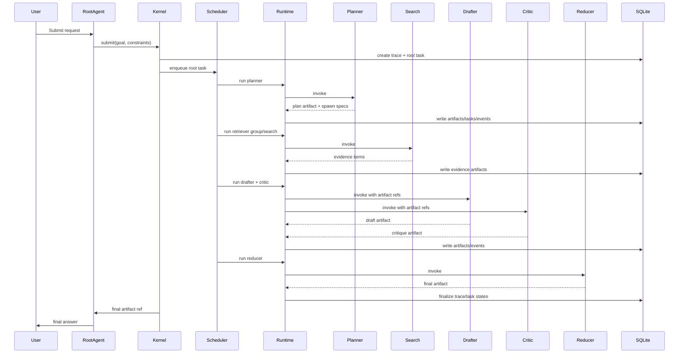

# AgentLoop 微内核技术方案（Python + SQLite）

## 1. 文档目标

本文档给出一套**可直接指导开发**的 AgentLoop 微内核技术方案，严格限制技术栈为：

- **Python 3.11+**
- **SQLite 3.39+**

不引入 Redis、PostgreSQL、Kafka、Celery 等外部依赖。  
方案重点解决以下问题：

1. 主 agent 如何高效调用子 agent 和工具。
2. 如何实现高效任务派发。
3. 如何实现高效结果聚合。
4. 如何避免“多 agent 直接对话”带来的上下文膨胀和耦合。
5. 如何在不引入完整 DAG 编排系统的前提下，获得 DAG 的主要收益。

---

## 2. 核心结论

本方案采用如下折中模型：

- **控制流：任务树（Task Tree）**
- **数据流：Artifact DAG（共享中间结果）**

一句话概括：

> **谁负责谁**，按树管理；  
> **谁复用谁的结果**，按图管理。

这样设计的原因：

- 任务生命周期、取消、预算继承、失败传播天然适合树。
- 中间结果共享、局部重跑、缓存复用天然适合 DAG。
- 相比“全系统完整 DAG 编排”，复杂度更低，更适合 v1 落地。

---

## 3. 适用范围与非目标

## 3.1 适用范围

本方案适合以下类型系统：

- 一个主 agent 驱动多个子 agent / 工具的复杂问答系统
- 需要并发派发与分层聚合的 agent 系统
- 需要可观测、可取消、可重试、可审计的运行时
- 需要中间结果复用但不想一开始就做完整 DAG 调度器

## 3.2 非目标

本方案 v1 **不追求**：

- 任意复杂的全局最优调度
- 大规模多机分布式执行
- 强实时（毫秒级）消息系统
- 完整工作流 DSL
- 任意 agent 横向自由通信

---

## 4. 总体架构

## 4.1 逻辑架构图



---

## 4.2 分层说明

### A. Root Agent（根 agent）
职责很窄：

- 理解用户意图
- 产出任务计划
- 定义成功标准
- 读取最终聚合结果并生成面向用户的输出

Root Agent **不直接**：

- 手工管理所有子 agent 生命周期
- 直接与子 agent 自由聊天
- 直接管理所有工具调用细节

### B. Microkernel（微内核）
系统总控，负责：

- 任务树管理
- 事件循环
- 调度
- Artifact 管理
- 预算控制
- 重试 / 取消
- 分层聚合
- 可观测性

### C. Capability（能力）
统一抽象 agent 和工具。

分为三类：

- `agent`：规划、起草、批评、总结
- `tool`：搜索、文件读取、SQL 查询、代码执行
- `reducer`：局部聚合、终局聚合

统一调用接口：

```python
result = capability.invoke(request, context)
```

### D. Artifact Store（中间结果存储）
所有大对象都存为 artifact，而不是通过消息直接传大文本。  
任务之间**不直接通信**，只共享 artifact 引用。

---

## 5. 核心设计原则

1. **Agent 之间禁止直接互发消息**
2. **任务之间只共享 artifact，不共享完整对话**
3. **控制流按树管理，数据流按图管理**
4. **消息只传元数据与引用，不传大对象**
5. **所有执行都带 trace_id / task_id**
6. **所有任务都有预算、截止时间、重试上限**
7. **所有中间结果都可审计、可缓存、可重用**
8. **聚合器只看结构化 artifact，不直接阅读大量自然语言消息**

---

## 6. 数据模型设计

## 6.1 核心实体

### Trace
一次用户请求的完整执行链路。

### Task
一个可调度的工作单元。  
控制流层面的实体，形成树结构。

### Artifact
任务产出的中间结果或最终结果。  
数据流层面的实体，可被多个任务消费，形成图结构。

### Dependency
任务对 artifact 的读写依赖关系。

### Event
内核运行过程中的状态变化、调用记录和审计日志。

---

## 7. SQLite 表结构设计

## 7.1 SQLite 配置建议

启动时必须执行：

```sql
PRAGMA journal_mode = WAL;
PRAGMA synchronous = NORMAL;
PRAGMA foreign_keys = ON;
PRAGMA temp_store = MEMORY;
PRAGMA busy_timeout = 3000;
```

说明：

- `WAL`：提升并发读性能
- `NORMAL`：平衡可靠性和性能
- `foreign_keys=ON`：保证引用完整性
- `busy_timeout`：避免并发写时立即报错

---

## 7.2 traces 表

```sql
CREATE TABLE IF NOT EXISTS traces (
    trace_id TEXT PRIMARY KEY,
    root_task_id TEXT,
    user_input TEXT NOT NULL,
    status TEXT NOT NULL CHECK(status IN ('NEW', 'RUNNING', 'DONE', 'FAILED', 'CANCELED')),
    success_criteria TEXT,
    created_at INTEGER NOT NULL,
    updated_at INTEGER NOT NULL,
    finished_at INTEGER
);
```

---

## 7.3 tasks 表

```sql
CREATE TABLE IF NOT EXISTS tasks (
    task_id TEXT PRIMARY KEY,
    trace_id TEXT NOT NULL,
    parent_task_id TEXT,
    task_kind TEXT NOT NULL CHECK(task_kind IN ('ROOT', 'AGENT', 'TOOL', 'REDUCER')),
    capability_name TEXT NOT NULL,
    intent TEXT NOT NULL,
    state TEXT NOT NULL CHECK(state IN (
        'NEW',
        'READY',
        'LEASED',
        'RUNNING',
        'WAITING_CHILDREN',
        'WAITING_ARTIFACTS',
        'REDUCING',
        'DONE',
        'FAILED',
        'CANCELED',
        'STALE'
    )),
    priority INTEGER NOT NULL DEFAULT 100,
    depth INTEGER NOT NULL DEFAULT 0,
    budget_tokens INTEGER NOT NULL DEFAULT 0,
    budget_millis INTEGER NOT NULL DEFAULT 0,
    budget_cost_cents INTEGER NOT NULL DEFAULT 0,
    deadline_ts INTEGER,
    attempt_no INTEGER NOT NULL DEFAULT 0,
    max_retries INTEGER NOT NULL DEFAULT 1,
    expected_children INTEGER NOT NULL DEFAULT 0,
    finished_children INTEGER NOT NULL DEFAULT 0,
    join_policy TEXT NOT NULL DEFAULT 'ALL' CHECK(join_policy IN ('ALL', 'ANY', 'QUORUM')),
    quorum_n INTEGER,
    input_schema TEXT,
    output_schema TEXT,
    request_payload TEXT,
    result_artifact_id TEXT,
    error_code TEXT,
    error_message TEXT,
    lease_owner TEXT,
    lease_until INTEGER,
    created_at INTEGER NOT NULL,
    updated_at INTEGER NOT NULL,
    started_at INTEGER,
    finished_at INTEGER,
    FOREIGN KEY(trace_id) REFERENCES traces(trace_id),
    FOREIGN KEY(parent_task_id) REFERENCES tasks(task_id),
    FOREIGN KEY(result_artifact_id) REFERENCES artifacts(artifact_id)
);
```

---

## 7.4 artifacts 表

```sql
CREATE TABLE IF NOT EXISTS artifacts (
    artifact_id TEXT PRIMARY KEY,
    trace_id TEXT NOT NULL,
    producer_task_id TEXT NOT NULL,
    artifact_type TEXT NOT NULL,
    version INTEGER NOT NULL DEFAULT 1,
    status TEXT NOT NULL CHECK(status IN ('PENDING', 'READY', 'STALE', 'DELETED')),
    storage_kind TEXT NOT NULL CHECK(storage_kind IN ('INLINE', 'FILE')),
    payload_text TEXT,
    payload_path TEXT,
    payload_hash TEXT,
    confidence REAL,
    metadata_json TEXT,
    created_at INTEGER NOT NULL,
    updated_at INTEGER NOT NULL,
    FOREIGN KEY(trace_id) REFERENCES traces(trace_id),
    FOREIGN KEY(producer_task_id) REFERENCES tasks(task_id)
);
```

---

## 7.5 task_artifact_deps 表

```sql
CREATE TABLE IF NOT EXISTS task_artifact_deps (
    dep_id INTEGER PRIMARY KEY AUTOINCREMENT,
    task_id TEXT NOT NULL,
    artifact_id TEXT NOT NULL,
    mode TEXT NOT NULL CHECK(mode IN ('READ', 'WRITE')),
    required INTEGER NOT NULL DEFAULT 1 CHECK(required IN (0, 1)),
    alias TEXT,
    created_at INTEGER NOT NULL,
    UNIQUE(task_id, artifact_id, mode, alias),
    FOREIGN KEY(task_id) REFERENCES tasks(task_id),
    FOREIGN KEY(artifact_id) REFERENCES artifacts(artifact_id)
);
```

---

## 7.6 events 表

```sql
CREATE TABLE IF NOT EXISTS events (
    event_id INTEGER PRIMARY KEY AUTOINCREMENT,
    trace_id TEXT NOT NULL,
    task_id TEXT,
    parent_task_id TEXT,
    event_type TEXT NOT NULL,
    event_payload TEXT,
    created_at INTEGER NOT NULL,
    FOREIGN KEY(trace_id) REFERENCES traces(trace_id),
    FOREIGN KEY(task_id) REFERENCES tasks(task_id),
    FOREIGN KEY(parent_task_id) REFERENCES tasks(task_id)
);
```

---

## 7.7 capability_registry 表

```sql
CREATE TABLE IF NOT EXISTS capability_registry (
    capability_name TEXT PRIMARY KEY,
    capability_kind TEXT NOT NULL CHECK(capability_kind IN ('agent', 'tool', 'reducer')),
    is_enabled INTEGER NOT NULL DEFAULT 1 CHECK(is_enabled IN (0, 1)),
    max_concurrency INTEGER NOT NULL DEFAULT 1,
    avg_latency_ms INTEGER NOT NULL DEFAULT 0,
    avg_cost_cents INTEGER NOT NULL DEFAULT 0,
    success_rate REAL NOT NULL DEFAULT 1.0,
    cacheable INTEGER NOT NULL DEFAULT 0 CHECK(cacheable IN (0, 1)),
    config_json TEXT,
    updated_at INTEGER NOT NULL
);
```

---

## 7.8 推荐索引

```sql
CREATE INDEX IF NOT EXISTS idx_tasks_trace_state_priority
ON tasks(trace_id, state, priority);

CREATE INDEX IF NOT EXISTS idx_tasks_parent
ON tasks(parent_task_id);

CREATE INDEX IF NOT EXISTS idx_tasks_lease
ON tasks(state, lease_until);

CREATE INDEX IF NOT EXISTS idx_artifacts_trace_status
ON artifacts(trace_id, status);

CREATE INDEX IF NOT EXISTS idx_deps_task
ON task_artifact_deps(task_id);

CREATE INDEX IF NOT EXISTS idx_deps_artifact
ON task_artifact_deps(artifact_id);

CREATE INDEX IF NOT EXISTS idx_events_trace
ON events(trace_id, created_at);
```

---

## 8. 控制流与数据流模型

## 8.1 控制流：任务树

控制流只表示责任归属和生命周期：



用途：

- spawn / cancel 子树
- 预算继承
- 失败传播
- barrier / join
- trace 展示

---

## 8.2 数据流：Artifact DAG

数据依赖使用 artifact 共享表示：



用途：

- 结果复用
- 局部重跑
- 局部聚合
- 结构化输入

---

## 9. 状态机设计

## 9.1 Trace 状态机



---

## 9.2 Task 状态机



---

## 10. 消息协议设计

虽然系统底层不一定需要独立消息队列，但逻辑上仍然建议定义统一 envelope。

```json
{
  "msg_id": "uuid",
  "trace_id": "trace_001",
  "task_id": "task_001",
  "parent_task_id": "task_root",
  "kind": "TASK_SUBMIT|TASK_SPAWN|TASK_READY|TASK_START|TASK_DONE|TASK_FAIL|TASK_CANCEL|ARTIFACT_READY",
  "sender": "kernel",
  "recipient": "scheduler",
  "intent": "retrieve_evidence",
  "artifact_refs": ["artifact://trace_001/evidence/1"],
  "constraints": {
    "deadline_ms": 3000,
    "max_tokens": 2000,
    "max_cost_cents": 5
  },
  "payload": {},
  "created_at": 1710000000
}
```

v1 中，消息可以不通过独立 MQ 实现，而是：

- **运行中消息：Python 内存队列**
- **持久化审计：SQLite events 表**

---

## 11. 目录结构建议

```text
agentloop/
├─ app.py
├─ config.py
├─ db.py
├─ schema.sql
├─ kernel/
│  ├─ models.py
│  ├─ ids.py
│  ├─ clock.py
│  ├─ eventlog.py
│  ├─ context.py
│  ├─ task_repo.py
│  ├─ artifact_repo.py
│  ├─ dep_repo.py
│  ├─ trace_repo.py
│  ├─ scheduler.py
│  ├─ reducer.py
│  ├─ runtime.py
│  ├─ kernel.py
│  └─ policies.py
├─ capabilities/
│  ├─ base.py
│  ├─ planner.py
│  ├─ drafter.py
│  ├─ critic.py
│  ├─ reducers.py
│  └─ tools/
│     ├─ search_tool.py
│     ├─ file_tool.py
│     └─ python_exec_tool.py
└─ tests/
   ├─ test_scheduler.py
   ├─ test_reducer.py
   ├─ test_artifacts.py
   └─ test_end_to_end.py
```

---

## 12. 模块职责

## 12.1 db.py
负责：

- 打开 SQLite 连接
- 设置 PRAGMA
- 执行 schema 初始化
- 提供事务上下文

## 12.2 task_repo.py
负责：

- 创建任务
- 更新任务状态
- 领取 ready 任务
- 记录子任务完成计数
- 查询父子关系

## 12.3 artifact_repo.py
负责：

- 创建 artifact
- 更新 artifact 状态
- 读取 artifact 内容
- 计算 hash
- 判断 artifact 是否可复用

## 12.4 scheduler.py
负责：

- 选择下一个可执行任务
- 并发度控制
- 预算 / deadline 判断
- 优先级排序
- 从 WAITING_ARTIFACTS 推进到 READY

## 12.5 reducer.py
负责：

- 对同类子结果做局部归并
- 输出结构化 artifact
- 处理冲突、去重和排序

## 12.6 runtime.py
负责：

- 调用 capability
- 管理 asyncio 并发
- 处理结果、异常、重试和取消

## 12.7 kernel.py
负责：

- submit
- spawn
- reduce
- cancel
- 驱动整个事件循环

---

## 13. 执行流程

## 13.1 端到端流程



---

## 13.2 任务提交流程

1. 创建 trace
2. 创建 root task
3. root task 初始状态为 `READY`
4. 记录 `TASK_SUBMIT` 事件
5. 进入调度队列

---

## 13.3 任务执行流程

1. Scheduler 选择一个 `READY` 任务
2. 通过 lease 机制标记为 `LEASED`
3. Runtime 将其置为 `RUNNING`
4. 调用对应 capability
5. 根据返回结果：
   - 产出 artifact
   - spawn 子任务
   - 标记等待 children
   - 或直接 DONE
6. 更新父任务 barrier
7. 触发下游依赖检查

---

## 13.4 聚合流程

聚合分两层：

### 第一层：局部聚合
例如 `RetrieverGroup` 下多个搜索任务先合并为一个 `evidence_bundle` artifact。

### 第二层：终局聚合
`FinalReducer` 消费：

- `plan_artifact`
- `evidence_bundle`
- `draft_artifact`
- `critique_artifact`

输出最终 `final_result` artifact。

---

## 14. 调度设计

## 14.1 ready 的定义

一个任务可进入执行队列，必须同时满足：

1. 任务状态是 `READY`
2. 没有过期 lease
3. 没有超预算
4. 所有 required input artifact 都已经 `READY`

也就是：

```text
control_ready AND input_artifacts_ready
```

---

## 14.2 优先级策略

建议使用一个简单可落地的评分公式：

```text
effective_priority =
    base_priority
    - depth_penalty
    - estimated_cost_penalty
    - duplicate_penalty
    + unlock_bonus
    + nearing_deadline_bonus
```

v1 可简化为：

- priority 小的优先
- depth 小的优先
- deadline 近的优先

SQL 查询时使用：

```sql
ORDER BY priority ASC, depth ASC, created_at ASC
```

---

## 14.3 并发策略

由于只有 Python + SQLite，建议 v1 采用：

- **单进程**
- **asyncio 事件循环**
- **固定数量 worker coroutine**
- **SQLite WAL**

推荐：

- agent worker：2~4 个
- tool worker：4~8 个
- reducer worker：1~2 个

注意：SQLite 单写多读，写操作要短事务。

---

## 14.4 lease 机制

虽然 v1 是单进程，也建议保留 lease 机制，便于未来扩展多进程。

字段：

- `lease_owner`
- `lease_until`

领取 READY 任务时：

1. `BEGIN IMMEDIATE`
2. 选择一个符合条件的任务
3. 更新为 `LEASED`
4. 写入 lease_owner / lease_until
5. `COMMIT`

这样避免多个 worker 重复领取。

---

## 15. 关键 SQL 操作

## 15.1 查询可执行任务

```sql
SELECT t.task_id
FROM tasks t
WHERE t.state = 'READY'
  AND (t.lease_until IS NULL OR t.lease_until < :now_ts)
  AND (t.deadline_ts IS NULL OR t.deadline_ts > :now_ts)
  AND NOT EXISTS (
      SELECT 1
      FROM task_artifact_deps d
      JOIN artifacts a ON a.artifact_id = d.artifact_id
      WHERE d.task_id = t.task_id
        AND d.mode = 'READ'
        AND d.required = 1
        AND a.status <> 'READY'
  )
ORDER BY t.priority ASC, t.depth ASC, t.created_at ASC
LIMIT 1;
```

---

## 15.2 lease 一个任务

```sql
UPDATE tasks
SET state = 'LEASED',
    lease_owner = :lease_owner,
    lease_until = :lease_until,
    updated_at = :now_ts
WHERE task_id = :task_id
  AND state = 'READY'
  AND (lease_until IS NULL OR lease_until < :now_ts);
```

必须检查 `rowcount == 1` 才算领取成功。

---

## 15.3 启动任务

```sql
UPDATE tasks
SET state = 'RUNNING',
    started_at = :now_ts,
    updated_at = :now_ts,
    attempt_no = attempt_no + 1
WHERE task_id = :task_id
  AND state = 'LEASED';
```

---

## 15.4 创建 artifact

```sql
INSERT INTO artifacts (
    artifact_id, trace_id, producer_task_id, artifact_type, version,
    status, storage_kind, payload_text, payload_path, payload_hash,
    confidence, metadata_json, created_at, updated_at
) VALUES (
    :artifact_id, :trace_id, :producer_task_id, :artifact_type, :version,
    'READY', :storage_kind, :payload_text, :payload_path, :payload_hash,
    :confidence, :metadata_json, :created_at, :updated_at
);
```

---

## 15.5 任务完成

```sql
UPDATE tasks
SET state = 'DONE',
    result_artifact_id = :artifact_id,
    finished_at = :now_ts,
    updated_at = :now_ts,
    lease_owner = NULL,
    lease_until = NULL
WHERE task_id = :task_id;
```

---

## 15.6 父任务子项计数递增

```sql
UPDATE tasks
SET finished_children = finished_children + 1,
    updated_at = :now_ts
WHERE task_id = :parent_task_id;
```

---

## 15.7 判断父任务是否可进入 reduce

### join_policy = ALL

```sql
SELECT CASE
    WHEN expected_children > 0 AND finished_children >= expected_children THEN 1
    ELSE 0
END AS can_reduce
FROM tasks
WHERE task_id = :task_id;
```

---

## 15.8 失败后重试判断

```sql
SELECT attempt_no, max_retries
FROM tasks
WHERE task_id = :task_id;
```

Python 判断：

```python
should_retry = attempt_no <= max_retries
```

---

## 16. Python 数据结构

## 16.1 models.py

```python
from __future__ import annotations
from dataclasses import dataclass, field
from typing import Any, Optional

@dataclass
class TaskSpec:
    task_kind: str
    capability_name: str
    intent: str
    priority: int = 100
    budget_tokens: int = 0
    budget_millis: int = 0
    budget_cost_cents: int = 0
    deadline_ts: Optional[int] = None
    max_retries: int = 1
    input_schema: Optional[str] = None
    output_schema: Optional[str] = None
    request_payload: dict[str, Any] = field(default_factory=dict)

@dataclass
class ArtifactRef:
    artifact_id: str
    artifact_type: str

@dataclass
class CapabilityResult:
    status: str  # DONE / WAITING_CHILDREN / WAITING_ARTIFACTS / FAILED
    output_artifact: Optional[dict[str, Any]] = None
    spawn_specs: list[TaskSpec] = field(default_factory=list)
    read_artifacts: list[str] = field(default_factory=list)
    write_artifacts: list[dict[str, Any]] = field(default_factory=list)
    wait_for_artifacts: list[str] = field(default_factory=list)
    error_code: Optional[str] = None
    error_message: Optional[str] = None
```

---

## 17. SQLite 连接与事务封装

## 17.1 db.py

```python
import sqlite3
from contextlib import contextmanager

def connect(db_path: str) -> sqlite3.Connection:
    conn = sqlite3.connect(db_path, isolation_level=None, check_same_thread=False)
    conn.row_factory = sqlite3.Row

    conn.execute("PRAGMA journal_mode = WAL;")
    conn.execute("PRAGMA synchronous = NORMAL;")
    conn.execute("PRAGMA foreign_keys = ON;")
    conn.execute("PRAGMA temp_store = MEMORY;")
    conn.execute("PRAGMA busy_timeout = 3000;")
    return conn

@contextmanager
def tx(conn: sqlite3.Connection, immediate: bool = False):
    try:
        conn.execute("BEGIN IMMEDIATE" if immediate else "BEGIN")
        yield
        conn.execute("COMMIT")
    except Exception:
        conn.execute("ROLLBACK")
        raise
```

---

## 18. Repository 示例

## 18.1 创建 trace 和 root task

```python
import json
import time
import uuid

def now_ts() -> int:
    return int(time.time())

def new_id(prefix: str) -> str:
    return f"{prefix}_{uuid.uuid4().hex[:16]}"

def create_trace_and_root_task(conn, user_input: str, request_payload: dict) -> tuple[str, str]:
    trace_id = new_id("tr")
    root_task_id = new_id("tk")
    ts = now_ts()

    with tx(conn, immediate=True):
        conn.execute("""
            INSERT INTO traces(trace_id, root_task_id, user_input, status, success_criteria, created_at, updated_at)
            VALUES (?, ?, ?, 'RUNNING', ?, ?, ?)
        """, (trace_id, root_task_id, user_input, json.dumps({"kind": "final_answer"}), ts, ts))

        conn.execute("""
            INSERT INTO tasks(
                task_id, trace_id, parent_task_id, task_kind, capability_name, intent, state,
                priority, depth, budget_tokens, budget_millis, budget_cost_cents, deadline_ts,
                attempt_no, max_retries, expected_children, finished_children, join_policy,
                input_schema, output_schema, request_payload, created_at, updated_at
            )
            VALUES (?, ?, NULL, 'ROOT', 'root_agent', 'handle_user_request', 'READY',
                    10, 0, 0, 0, 0, NULL,
                    0, 1, 0, 0, 'ALL',
                    NULL, 'final_result_v1', ?, ?, ?)
        """, (root_task_id, trace_id, json.dumps(request_payload), ts, ts))

        conn.execute("""
            INSERT INTO events(trace_id, task_id, parent_task_id, event_type, event_payload, created_at)
            VALUES (?, ?, NULL, 'TASK_SUBMIT', ?, ?)
        """, (trace_id, root_task_id, json.dumps({"user_input": user_input}), ts))

    return trace_id, root_task_id
```

---

## 18.2 领取 ready 任务

```python
def lease_one_ready_task(conn, lease_owner: str, lease_seconds: int = 30):
    now = now_ts()
    lease_until = now + lease_seconds

    with tx(conn, immediate=True):
        row = conn.execute("""
            SELECT t.task_id
            FROM tasks t
            WHERE t.state = 'READY'
              AND (t.lease_until IS NULL OR t.lease_until < ?)
              AND (t.deadline_ts IS NULL OR t.deadline_ts > ?)
              AND NOT EXISTS (
                  SELECT 1
                  FROM task_artifact_deps d
                  JOIN artifacts a ON a.artifact_id = d.artifact_id
                  WHERE d.task_id = t.task_id
                    AND d.mode = 'READ'
                    AND d.required = 1
                    AND a.status <> 'READY'
              )
            ORDER BY t.priority ASC, t.depth ASC, t.created_at ASC
            LIMIT 1
        """, (now, now)).fetchone()

        if not row:
            return None

        task_id = row["task_id"]
        cur = conn.execute("""
            UPDATE tasks
            SET state = 'LEASED',
                lease_owner = ?,
                lease_until = ?,
                updated_at = ?
            WHERE task_id = ?
              AND state = 'READY'
              AND (lease_until IS NULL OR lease_until < ?)
        """, (lease_owner, lease_until, now, task_id, now))

        if cur.rowcount != 1:
            return None

        task = conn.execute("SELECT * FROM tasks WHERE task_id = ?", (task_id,)).fetchone()
        return dict(task)
```

---

## 18.3 启动任务

```python
def mark_task_running(conn, task_id: str):
    ts = now_ts()
    with tx(conn, immediate=True):
        conn.execute("""
            UPDATE tasks
            SET state = 'RUNNING',
                started_at = COALESCE(started_at, ?),
                updated_at = ?,
                attempt_no = attempt_no + 1
            WHERE task_id = ?
              AND state = 'LEASED'
        """, (ts, ts, task_id))

        trace_id = conn.execute("SELECT trace_id FROM tasks WHERE task_id = ?", (task_id,)).fetchone()["trace_id"]
        conn.execute("""
            INSERT INTO events(trace_id, task_id, parent_task_id, event_type, event_payload, created_at)
            VALUES (?, ?, NULL, 'TASK_START', ?, ?)
        """, (trace_id, task_id, "{}", ts))
```

---

## 19. Capability 接口设计

## 19.1 基类

```python
from abc import ABC, abstractmethod
from typing import Any

class Capability(ABC):
    name: str
    kind: str  # agent / tool / reducer

    @abstractmethod
    async def invoke(self, request: dict[str, Any], context: dict[str, Any]) -> CapabilityResult:
        raise NotImplementedError
```

---

## 19.2 Registry

```python
class CapabilityRegistry:
    def __init__(self):
        self._caps = {}

    def register(self, capability: Capability):
        self._caps[capability.name] = capability

    def get(self, name: str) -> Capability:
        return self._caps[name]
```

---

## 20. 示例 Capability

## 20.1 PlannerAgent

```python
class PlannerAgent(Capability):
    name = "planner_agent"
    kind = "agent"

    async def invoke(self, request, context):
        # request: {"user_goal": "..."}
        goal = request["user_goal"]

        spawn_specs = [
            TaskSpec(
                task_kind="TOOL",
                capability_name="search_tool",
                intent="retrieve_evidence",
                priority=20,
                output_schema="search_result_v1",
                request_payload={"query": goal, "slot": 1}
            ),
            TaskSpec(
                task_kind="TOOL",
                capability_name="search_tool",
                intent="retrieve_evidence",
                priority=20,
                output_schema="search_result_v1",
                request_payload={"query": goal, "slot": 2}
            ),
            TaskSpec(
                task_kind="AGENT",
                capability_name="drafter_agent",
                intent="draft_solution",
                priority=30,
                input_schema="plan_and_evidence_v1",
                output_schema="draft_v1",
                request_payload={"goal": goal}
            ),
            TaskSpec(
                task_kind="AGENT",
                capability_name="critic_agent",
                intent="critic_solution",
                priority=35,
                input_schema="plan_and_evidence_v1",
                output_schema="critique_v1",
                request_payload={"goal": goal}
            ),
        ]

        return CapabilityResult(
            status="WAITING_CHILDREN",
            output_artifact={
                "artifact_type": "plan_v1",
                "payload": {
                    "goal": goal,
                    "subtasks": [
                        "retrieve_evidence",
                        "draft_solution",
                        "critic_solution"
                    ]
                }
            },
            spawn_specs=spawn_specs
        )
```

> 注：真正生产环境中，planner_agent 应该输出结构化计划，而不是硬编码。  
> 这里是开发示例，用于说明微内核接口。

---

## 20.2 SearchTool

```python
import asyncio

class SearchTool(Capability):
    name = "search_tool"
    kind = "tool"

    async def invoke(self, request, context):
        query = request["query"]
        slot = request["slot"]

        # 这里用 sleep 模拟外部工具调用
        await asyncio.sleep(0.1)

        return CapabilityResult(
            status="DONE",
            output_artifact={
                "artifact_type": "search_result_v1",
                "payload": {
                    "query": query,
                    "slot": slot,
                    "items": [
                        {"title": f"doc-{slot}-1", "score": 0.91},
                        {"title": f"doc-{slot}-2", "score": 0.88},
                    ]
                }
            }
        )
```

---

## 20.3 DrafterAgent

```python
class DrafterAgent(Capability):
    name = "drafter_agent"
    kind = "agent"

    async def invoke(self, request, context):
        plan = context["artifacts"]["plan_v1"]
        evidence = context["artifacts"]["evidence_bundle_v1"]

        return CapabilityResult(
            status="DONE",
            output_artifact={
                "artifact_type": "draft_v1",
                "payload": {
                    "summary": "这是根据 plan + evidence 生成的草案。",
                    "plan_goal": plan["goal"],
                    "evidence_count": len(evidence["items"])
                }
            }
        )
```

---

## 20.4 CriticAgent

```python
class CriticAgent(Capability):
    name = "critic_agent"
    kind = "agent"

    async def invoke(self, request, context):
        draft = context["artifacts"].get("draft_v1")
        evidence = context["artifacts"]["evidence_bundle_v1"]

        risks = []
        if not evidence["items"]:
            risks.append("缺少证据")

        if draft is None:
            risks.append("草案尚未生成，无法进行完整评审")

        return CapabilityResult(
            status="DONE",
            output_artifact={
                "artifact_type": "critique_v1",
                "payload": {
                    "risks": risks,
                    "score": 0.76
                }
            }
        )
```

---

## 20.5 Reducer

```python
class FinalReducer(Capability):
    name = "final_reducer"
    kind = "reducer"

    async def invoke(self, request, context):
        plan = context["artifacts"]["plan_v1"]
        evidence = context["artifacts"]["evidence_bundle_v1"]
        draft = context["artifacts"]["draft_v1"]
        critique = context["artifacts"]["critique_v1"]

        final_payload = {
            "goal": plan["goal"],
            "draft": draft,
            "critique": critique,
            "evidence_count": len(evidence["items"]),
            "final_text": "这是最终聚合结果。"
        }

        return CapabilityResult(
            status="DONE",
            output_artifact={
                "artifact_type": "final_result_v1",
                "payload": final_payload
            }
        )
```

---

## 21. Artifact 聚合策略

## 21.1 为什么要有局部 reducer

如果让根任务直接看所有叶子输出，会导致：

- 输入过多
- 上下文臃肿
- 聚合逻辑混乱
- 重复去重困难

因此建议先做局部 reducer，例如：

### RetrieverGroupReducer
输入：多个 `search_result_v1`  
输出：一个 `evidence_bundle_v1`

### DraftReducer（可选）
输入：多个草案  
输出：一个最佳草案

### FinalReducer
输入：计划、证据、草案、评审  
输出：最终结果

---

## 21.2 RetrieverGroupReducer 示例

```python
class RetrieverGroupReducer(Capability):
    name = "retriever_group_reducer"
    kind = "reducer"

    async def invoke(self, request, context):
        search_results = context["artifact_list"]["search_result_v1"]

        merged = []
        seen = set()
        for result in search_results:
            for item in result["items"]:
                key = item["title"]
                if key not in seen:
                    seen.add(key)
                    merged.append(item)

        merged.sort(key=lambda x: x["score"], reverse=True)

        return CapabilityResult(
            status="DONE",
            output_artifact={
                "artifact_type": "evidence_bundle_v1",
                "payload": {
                    "items": merged[:10]
                }
            }
        )
```

---

## 22. Context 构建规则

任务执行时，不应该把整棵树或完整聊天历史都传给子能力。  
应该只传：

1. request_payload
2. 该任务声明的 input artifact
3. 必要的 trace 摘要
4. 预算约束

推荐上下文结构：

```python
context = {
    "trace_id": "tr_xxx",
    "task_id": "tk_xxx",
    "constraints": {
        "deadline_ts": 1710000000,
        "budget_tokens": 2000,
        "budget_millis": 5000
    },
    "artifacts": {
        "plan_v1": {...},
        "evidence_bundle_v1": {...}
    },
    "artifact_list": {
        "search_result_v1": [{...}, {...}]
    }
}
```

规则：

- **只传当前任务所需 artifact**
- 不传兄弟任务完整日志
- 不传无关用户历史
- 尽量使用结构化 artifact，而不是自然语言摘要

---

## 23. Kernel 主循环设计

## 23.1 运行时模型

建议 v1 用：

- 一个 asyncio event loop
- 一个调度协程
- 若干 worker 协程
- SQLite 作为状态存储和审计日志

---

## 23.2 核心循环示例

```python
import asyncio

class Kernel:
    def __init__(self, conn, registry, scheduler, runtime):
        self.conn = conn
        self.registry = registry
        self.scheduler = scheduler
        self.runtime = runtime
        self.shutdown = False

    async def submit(self, user_input: str) -> tuple[str, str]:
        trace_id, root_task_id = create_trace_and_root_task(
            self.conn,
            user_input=user_input,
            request_payload={"user_goal": user_input}
        )
        return trace_id, root_task_id

    async def run_forever(self, worker_count: int = 4):
        workers = [asyncio.create_task(self.worker_loop(i)) for i in range(worker_count)]
        await asyncio.gather(*workers)

    async def worker_loop(self, worker_idx: int):
        lease_owner = f"worker-{worker_idx}"
        while not self.shutdown:
            task = lease_one_ready_task(self.conn, lease_owner=lease_owner, lease_seconds=30)
            if not task:
                await asyncio.sleep(0.05)
                continue

            mark_task_running(self.conn, task["task_id"])

            try:
                await self.runtime.execute_task(task)
            except Exception as exc:
                self.runtime.handle_task_exception(task, exc)
```

---

## 24. Runtime.execute_task 设计

```python
import json
import time
import hashlib

def stable_hash(text: str) -> str:
    return hashlib.sha256(text.encode("utf-8")).hexdigest()

class Runtime:
    def __init__(self, conn, registry):
        self.conn = conn
        self.registry = registry

    async def execute_task(self, task: dict):
        capability = self.registry.get(task["capability_name"])
        request = json.loads(task["request_payload"] or "{}")
        context = self.build_context(task["task_id"])

        result = await capability.invoke(request, context)

        if result.status == "DONE":
            artifact_id = self.write_output_artifact(task, result.output_artifact)
            self.mark_task_done(task, artifact_id)
            self.after_task_done(task)

        elif result.status == "WAITING_CHILDREN":
            artifact_id = None
            if result.output_artifact:
                artifact_id = self.write_output_artifact(task, result.output_artifact)

            self.spawn_children(task, result.spawn_specs)
            self.mark_task_waiting_children(task, artifact_id, expected_children=len(result.spawn_specs))

        elif result.status == "WAITING_ARTIFACTS":
            self.mark_task_waiting_artifacts(task, result.wait_for_artifacts)

        else:
            self.mark_task_failed(task, result.error_code or "UNKNOWN", result.error_message or "Unknown error")

    def build_context(self, task_id: str) -> dict:
        task = self.conn.execute("SELECT * FROM tasks WHERE task_id = ?", (task_id,)).fetchone()
        deps = self.conn.execute("""
            SELECT d.mode, d.alias, a.artifact_type, a.payload_text
            FROM task_artifact_deps d
            JOIN artifacts a ON a.artifact_id = d.artifact_id
            WHERE d.task_id = ?
              AND d.mode = 'READ'
              AND a.status = 'READY'
        """, (task_id,)).fetchall()

        artifacts = {}
        artifact_list = {}

        for row in deps:
            payload = json.loads(row["payload_text"]) if row["payload_text"] else None
            artifact_type = row["artifact_type"]
            alias = row["alias"]

            if alias:
                artifacts[alias] = payload
            else:
                if artifact_type.endswith("_v1"):
                    artifact_list.setdefault(artifact_type, []).append(payload)
                else:
                    artifacts[artifact_type] = payload

        return {
            "trace_id": task["trace_id"],
            "task_id": task_id,
            "constraints": {
                "deadline_ts": task["deadline_ts"],
                "budget_tokens": task["budget_tokens"],
                "budget_millis": task["budget_millis"],
                "budget_cost_cents": task["budget_cost_cents"],
            },
            "artifacts": artifacts,
            "artifact_list": artifact_list,
        }
```

---

## 25. Runtime 内部关键写操作

## 25.1 写 artifact

```python
def write_output_artifact(self, task: dict, output_artifact: dict | None) -> str | None:
    if not output_artifact:
        return None

    ts = now_ts()
    payload_text = json.dumps(output_artifact["payload"], ensure_ascii=False)
    artifact_hash = stable_hash(payload_text)
    artifact_id = new_id("af")

    with tx(self.conn, immediate=True):
        self.conn.execute("""
            INSERT INTO artifacts(
                artifact_id, trace_id, producer_task_id, artifact_type, version,
                status, storage_kind, payload_text, payload_path, payload_hash,
                confidence, metadata_json, created_at, updated_at
            ) VALUES (?, ?, ?, ?, 1, 'READY', 'INLINE', ?, NULL, ?, NULL, ?, ?, ?)
        """, (
            artifact_id,
            task["trace_id"],
            task["task_id"],
            output_artifact["artifact_type"],
            payload_text,
            artifact_hash,
            json.dumps({}, ensure_ascii=False),
            ts,
            ts,
        ))

        self.conn.execute("""
            INSERT INTO events(trace_id, task_id, parent_task_id, event_type, event_payload, created_at)
            VALUES (?, ?, ?, 'ARTIFACT_READY', ?, ?)
        """, (
            task["trace_id"],
            task["task_id"],
            task["parent_task_id"],
            json.dumps({"artifact_id": artifact_id, "artifact_type": output_artifact["artifact_type"]}, ensure_ascii=False),
            ts,
        ))

    return artifact_id
```

---

## 25.2 spawn 子任务

```python
def spawn_children(self, parent_task: dict, specs: list[TaskSpec]):
    ts = now_ts()

    with tx(self.conn, immediate=True):
        for spec in specs:
            child_id = new_id("tk")

            self.conn.execute("""
                INSERT INTO tasks(
                    task_id, trace_id, parent_task_id, task_kind, capability_name, intent, state,
                    priority, depth, budget_tokens, budget_millis, budget_cost_cents, deadline_ts,
                    attempt_no, max_retries, expected_children, finished_children, join_policy,
                    input_schema, output_schema, request_payload, created_at, updated_at
                )
                VALUES (?, ?, ?, ?, ?, ?, 'READY',
                        ?, ?, ?, ?, ?, ?,
                        0, ?, 0, 0, 'ALL',
                        ?, ?, ?, ?, ?)
            """, (
                child_id,
                parent_task["trace_id"],
                parent_task["task_id"],
                spec.task_kind,
                spec.capability_name,
                spec.intent,
                spec.priority,
                parent_task["depth"] + 1,
                spec.budget_tokens,
                spec.budget_millis,
                spec.budget_cost_cents,
                spec.deadline_ts,
                spec.max_retries,
                spec.input_schema,
                spec.output_schema,
                json.dumps(spec.request_payload, ensure_ascii=False),
                ts,
                ts,
            ))

            self.conn.execute("""
                INSERT INTO events(trace_id, task_id, parent_task_id, event_type, event_payload, created_at)
                VALUES (?, ?, ?, 'TASK_SPAWN', ?, ?)
            """, (
                parent_task["trace_id"],
                child_id,
                parent_task["task_id"],
                json.dumps({
                    "capability_name": spec.capability_name,
                    "intent": spec.intent
                }, ensure_ascii=False),
                ts
            ))
```

---

## 25.3 任务完成与父任务推进

```python
def mark_task_done(self, task: dict, artifact_id: str | None):
    ts = now_ts()
    with tx(self.conn, immediate=True):
        self.conn.execute("""
            UPDATE tasks
            SET state = 'DONE',
                result_artifact_id = ?,
                finished_at = ?,
                updated_at = ?,
                lease_owner = NULL,
                lease_until = NULL
            WHERE task_id = ?
        """, (artifact_id, ts, ts, task["task_id"]))

        self.conn.execute("""
            INSERT INTO events(trace_id, task_id, parent_task_id, event_type, event_payload, created_at)
            VALUES (?, ?, ?, 'TASK_DONE', ?, ?)
        """, (
            task["trace_id"],
            task["task_id"],
            task["parent_task_id"],
            json.dumps({"artifact_id": artifact_id}, ensure_ascii=False),
            ts
        ))

        if task["parent_task_id"]:
            self.conn.execute("""
                UPDATE tasks
                SET finished_children = finished_children + 1,
                    updated_at = ?
                WHERE task_id = ?
            """, (ts, task["parent_task_id"]))
```

---

## 25.4 父任务是否应转入 REDUCING

```python
def after_task_done(self, task: dict):
    parent_id = task["parent_task_id"]
    if not parent_id:
        self.try_finish_trace(task["trace_id"])
        return

    parent = self.conn.execute("""
        SELECT task_id, expected_children, finished_children, state, capability_name
        FROM tasks WHERE task_id = ?
    """, (parent_id,)).fetchone()

    if not parent:
        return

    if parent["state"] == "WAITING_CHILDREN" and parent["finished_children"] >= parent["expected_children"]:
        ts = now_ts()
        with tx(self.conn, immediate=True):
            self.conn.execute("""
                UPDATE tasks
                SET state = 'REDUCING',
                    updated_at = ?
                WHERE task_id = ?
            """, (ts, parent_id))

            self.conn.execute("""
                INSERT INTO events(trace_id, task_id, parent_task_id, event_type, event_payload, created_at)
                VALUES (?, ?, NULL, 'TASK_REDUCING', ?, ?)
            """, (task["trace_id"], parent_id, "{}", ts))
```

---

## 26. Reducer 与父任务的协作模式

这里有两种实现方式：

### 方案 A：父任务自己 reducer
父任务在 `REDUCING` 状态下重新调用自己的 reducer capability。

优点：
- 表更少
- 逻辑直观

缺点：
- 父任务既像控制节点又像执行节点，语义稍混

### 方案 B：显式创建 reducer 子任务（推荐）
当父任务等待所有 children 完成后，内核为其创建一个 reducer 子任务。  
父任务继续等待 reducer 子任务完成。

优点：
- 任务语义统一
- trace 更清晰
- reducer 可重试、可观测、可替换

推荐 v1 就采用 **方案 B**。

---

## 26.1 reducer 子任务生成规则

例子：

- `RetrieverGroup` 的所有 `search_tool` 子任务完成后
- 内核自动创建 `retriever_group_reducer` 子任务
- reducer 读取这些 search artifacts
- 输出 `evidence_bundle_v1`

同理：

- 根任务的主要分支完成后
- 内核创建 `final_reducer` 子任务
- 最终得到 `final_result_v1`

---

## 27. 依赖注入规则

## 27.1 任务如何声明输入 artifact

v1 不建议 capability 自己随意读取全局 artifact。  
推荐在 spawn 时显式注入 dependency。

例如：

```python
def add_read_dep(conn, task_id: str, artifact_id: str, alias: str | None = None, required: bool = True):
    ts = now_ts()
    conn.execute("""
        INSERT INTO task_artifact_deps(task_id, artifact_id, mode, required, alias, created_at)
        VALUES (?, ?, 'READ', ?, ?, ?)
    """, (task_id, artifact_id, 1 if required else 0, alias, ts))
```

---

## 27.2 推荐注入策略

### Planner 输出后
将 `plan_v1` 注入给：

- drafter_agent
- critic_agent
- final_reducer

### RetrieverGroupReducer 输出后
将 `evidence_bundle_v1` 注入给：

- drafter_agent
- critic_agent
- final_reducer

### Drafter 输出后
将 `draft_v1` 注入给：

- critic_agent（可选）
- final_reducer

### Critic 输出后
将 `critique_v1` 注入给：

- final_reducer

---

## 28. 示例：一个完整任务树

用户问题：

> 设计 agentloop 微内核

期望执行图：

```text
Root(root_agent)
├─ Planner(planner_agent)
├─ RetrieverGroup(group_controller)
│  ├─ Search1(search_tool)
│  ├─ Search2(search_tool)
│  ├─ Search3(search_tool)
│  └─ RetrieverReducer(retriever_group_reducer)
├─ Drafter(drafter_agent)
├─ Critic(critic_agent)
└─ FinalReducer(final_reducer)
```

数据依赖：

```text
Planner -> plan_v1
Search1/2/3 -> search_result_v1
RetrieverReducer -> evidence_bundle_v1
Drafter reads: plan_v1 + evidence_bundle_v1
Critic reads: plan_v1 + evidence_bundle_v1 + draft_v1(optional)
FinalReducer reads: plan_v1 + evidence_bundle_v1 + draft_v1 + critique_v1
```

---

## 29. 取消、失败与重试策略

## 29.1 取消策略

### 子树取消
取消某个任务时，默认取消整棵控制子树。

SQL：

```sql
UPDATE tasks
SET state = 'CANCELED',
    updated_at = :now_ts,
    lease_owner = NULL,
    lease_until = NULL
WHERE task_id = :task_id
   OR parent_task_id = :task_id;
```

> 实际上需要递归取消，建议在 Python 中 DFS 处理所有后代 task。

---

## 29.2 失败策略

任务失败后分三种：

1. **可重试失败**
   - 超时
   - 临时工具错误
   - 上游 artifact 尚未 ready

2. **不可重试失败**
   - 参数错误
   - schema 不匹配
   - capability 不存在

3. **降级成功**
   - 某些非关键任务失败，但仍可以继续聚合

---

## 29.3 重试规则

建议：

- 每个 task 默认 `max_retries = 1`
- 重试退避：0.5s、1s、2s
- 重试时清空 lease
- 若超过上限，则标记 FAILED

```python
def handle_task_exception(self, task: dict, exc: Exception):
    row = self.conn.execute("""
        SELECT attempt_no, max_retries, trace_id
        FROM tasks WHERE task_id = ?
    """, (task["task_id"],)).fetchone()

    if row["attempt_no"] <= row["max_retries"]:
        ts = now_ts()
        with tx(self.conn, immediate=True):
            self.conn.execute("""
                UPDATE tasks
                SET state = 'READY',
                    error_code = ?,
                    error_message = ?,
                    lease_owner = NULL,
                    lease_until = NULL,
                    updated_at = ?
                WHERE task_id = ?
            """, ("RETRYABLE_ERROR", str(exc), ts, task["task_id"]))
    else:
        self.mark_task_failed(task, "FAILED", str(exc))
```

---

## 30. Budget 与熔断

v1 即使没有真实 token/cost 统计，也建议保留预算字段。  
原因是后续接入 LLM / 工具时无需改表。

预算维度：

- `budget_tokens`
- `budget_millis`
- `budget_cost_cents`
- `deadline_ts`

执行前检查：

1. deadline 是否过期
2. 当前 attempt 是否超预算
3. 父任务是否已取消

若不满足则直接降级或失败。

---

## 31. Artifact 版本与失效

v1 可以只保留版本号，但先不做复杂 MVCC。

建议：

- 每个 artifact 初始 `version = 1`
- 如果重算产生新结果，创建新 artifact，而不是覆盖旧 artifact
- 旧 artifact 可以标记 `STALE`

好处：

- 审计清晰
- 可回放
- 方便对比多次执行结果

---

## 32. 可观测性与审计

最小可观测项：

1. trace 生命周期
2. task 状态变化
3. artifact 生成记录
4. reducer 执行记录
5. 错误码与错误信息
6. 每个 capability 的平均耗时 / 成功率

事件日志统一写入 `events` 表。

### 常用 event_type

- `TASK_SUBMIT`
- `TASK_SPAWN`
- `TASK_START`
- `ARTIFACT_READY`
- `TASK_WAIT_CHILDREN`
- `TASK_WAIT_ARTIFACTS`
- `TASK_REDUCING`
- `TASK_DONE`
- `TASK_FAIL`
- `TASK_CANCEL`
- `TRACE_DONE`
- `TRACE_FAIL`

---

## 33. 为什么 SQLite 能支持这个方案

优点：

- 零依赖，部署简单
- 审计和状态天然持久化
- WAL 模式适合单进程多协程读多写少
- SQL 足够表达状态与依赖检查

限制：

- 高写并发能力有限
- 不适合多机共享热写入
- 无原生队列和分布式 lease
- 复杂 JSON 查询不如 PostgreSQL 舒服

因此 v1 推荐约束：

- 单进程
- asyncio
- 短事务
- 小规模并发
- 大 payload 用文件落盘而不是全塞进 SQLite

---

## 34. Payload 存储策略

推荐规则：

### 小 payload（< 64KB）
直接 `storage_kind = INLINE`，写入 `payload_text`

### 大 payload（>= 64KB）
写文件，例如：

```text
data/artifacts/tr_xxx/af_xxx.json
```

并记录：

- `storage_kind = FILE`
- `payload_path = "data/artifacts/tr_xxx/af_xxx.json"`

这样可减少 SQLite 膨胀。

---

## 35. 文件型 artifact 示例代码

```python
from pathlib import Path

ARTIFACT_DIR = Path("data/artifacts")

def write_artifact_payload(artifact_id: str, trace_id: str, payload: dict) -> tuple[str, str | None, str | None]:
    text = json.dumps(payload, ensure_ascii=False, indent=2)

    if len(text.encode("utf-8")) < 64 * 1024:
        return "INLINE", text, None

    trace_dir = ARTIFACT_DIR / trace_id
    trace_dir.mkdir(parents=True, exist_ok=True)
    path = trace_dir / f"{artifact_id}.json"
    path.write_text(text, encoding="utf-8")
    return "FILE", None, str(path)
```

---

## 36. 最小可运行原型的开发顺序

## 第 1 阶段：打通内核基本骨架
- [ ] 建 `schema.sql`
- [ ] 完成 `db.py`
- [ ] 完成 `create_trace_and_root_task`
- [ ] 完成 `lease_one_ready_task`
- [ ] 完成 `mark_task_running`
- [ ] 完成 `mark_task_done / mark_task_failed`

## 第 2 阶段：接入 capability
- [ ] 实现 `Capability` 抽象
- [ ] 实现 `CapabilityRegistry`
- [ ] 实现 `PlannerAgent`
- [ ] 实现 `SearchTool`
- [ ] 实现 `DrafterAgent`
- [ ] 实现 `CriticAgent`
- [ ] 实现 `FinalReducer`

## 第 3 阶段：打通 artifact 与依赖
- [ ] 实现 `artifact_repo`
- [ ] 实现 `task_artifact_deps`
- [ ] 完成 `build_context`
- [ ] 支持 reducer 读取多 artifact

## 第 4 阶段：支持 group reducer
- [ ] 实现 `RetrieverGroupReducer`
- [ ] 自动生成 reducer 子任务
- [ ] 完成 parent barrier 推进

## 第 5 阶段：完善错误处理
- [ ] 重试
- [ ] 子树取消
- [ ] artifact stale
- [ ] deadline 检查

## 第 6 阶段：补测试
- [ ] scheduler 单元测试
- [ ] reducer 单元测试
- [ ] 依赖检查测试
- [ ] trace 端到端测试

---

## 37. 测试用例建议

## 37.1 调度测试
- READY 且依赖满足的任务能被领取
- 依赖未满足的任务不能被领取
- lease 过期后任务可重新领取

## 37.2 聚合测试
- 多个 search_result 能合并成 evidence_bundle
- 去重正确
- 排序正确

## 37.3 重试测试
- capability 抛异常后任务进入 READY
- attempt 超限后进入 FAILED

## 37.4 取消测试
- 取消父任务时所有子任务变为 CANCELED

## 37.5 端到端测试
- 提交请求
- planner 生成子任务
- search 完成
- reducer 聚合
- drafter / critic 生成结果
- final_reducer 输出 final_result

---

## 38. 示例：schema.sql 汇总版

以下为可直接执行的初始化 SQL：

```sql
PRAGMA journal_mode = WAL;
PRAGMA synchronous = NORMAL;
PRAGMA foreign_keys = ON;
PRAGMA temp_store = MEMORY;
PRAGMA busy_timeout = 3000;

CREATE TABLE IF NOT EXISTS traces (
    trace_id TEXT PRIMARY KEY,
    root_task_id TEXT,
    user_input TEXT NOT NULL,
    status TEXT NOT NULL CHECK(status IN ('NEW', 'RUNNING', 'DONE', 'FAILED', 'CANCELED')),
    success_criteria TEXT,
    created_at INTEGER NOT NULL,
    updated_at INTEGER NOT NULL,
    finished_at INTEGER
);

CREATE TABLE IF NOT EXISTS tasks (
    task_id TEXT PRIMARY KEY,
    trace_id TEXT NOT NULL,
    parent_task_id TEXT,
    task_kind TEXT NOT NULL CHECK(task_kind IN ('ROOT', 'AGENT', 'TOOL', 'REDUCER')),
    capability_name TEXT NOT NULL,
    intent TEXT NOT NULL,
    state TEXT NOT NULL CHECK(state IN (
        'NEW',
        'READY',
        'LEASED',
        'RUNNING',
        'WAITING_CHILDREN',
        'WAITING_ARTIFACTS',
        'REDUCING',
        'DONE',
        'FAILED',
        'CANCELED',
        'STALE'
    )),
    priority INTEGER NOT NULL DEFAULT 100,
    depth INTEGER NOT NULL DEFAULT 0,
    budget_tokens INTEGER NOT NULL DEFAULT 0,
    budget_millis INTEGER NOT NULL DEFAULT 0,
    budget_cost_cents INTEGER NOT NULL DEFAULT 0,
    deadline_ts INTEGER,
    attempt_no INTEGER NOT NULL DEFAULT 0,
    max_retries INTEGER NOT NULL DEFAULT 1,
    expected_children INTEGER NOT NULL DEFAULT 0,
    finished_children INTEGER NOT NULL DEFAULT 0,
    join_policy TEXT NOT NULL DEFAULT 'ALL' CHECK(join_policy IN ('ALL', 'ANY', 'QUORUM')),
    quorum_n INTEGER,
    input_schema TEXT,
    output_schema TEXT,
    request_payload TEXT,
    result_artifact_id TEXT,
    error_code TEXT,
    error_message TEXT,
    lease_owner TEXT,
    lease_until INTEGER,
    created_at INTEGER NOT NULL,
    updated_at INTEGER NOT NULL,
    started_at INTEGER,
    finished_at INTEGER,
    FOREIGN KEY(trace_id) REFERENCES traces(trace_id),
    FOREIGN KEY(parent_task_id) REFERENCES tasks(task_id)
);

CREATE TABLE IF NOT EXISTS artifacts (
    artifact_id TEXT PRIMARY KEY,
    trace_id TEXT NOT NULL,
    producer_task_id TEXT NOT NULL,
    artifact_type TEXT NOT NULL,
    version INTEGER NOT NULL DEFAULT 1,
    status TEXT NOT NULL CHECK(status IN ('PENDING', 'READY', 'STALE', 'DELETED')),
    storage_kind TEXT NOT NULL CHECK(storage_kind IN ('INLINE', 'FILE')),
    payload_text TEXT,
    payload_path TEXT,
    payload_hash TEXT,
    confidence REAL,
    metadata_json TEXT,
    created_at INTEGER NOT NULL,
    updated_at INTEGER NOT NULL,
    FOREIGN KEY(trace_id) REFERENCES traces(trace_id),
    FOREIGN KEY(producer_task_id) REFERENCES tasks(task_id)
);

CREATE TABLE IF NOT EXISTS task_artifact_deps (
    dep_id INTEGER PRIMARY KEY AUTOINCREMENT,
    task_id TEXT NOT NULL,
    artifact_id TEXT NOT NULL,
    mode TEXT NOT NULL CHECK(mode IN ('READ', 'WRITE')),
    required INTEGER NOT NULL DEFAULT 1 CHECK(required IN (0, 1)),
    alias TEXT,
    created_at INTEGER NOT NULL,
    UNIQUE(task_id, artifact_id, mode, alias),
    FOREIGN KEY(task_id) REFERENCES tasks(task_id),
    FOREIGN KEY(artifact_id) REFERENCES artifacts(artifact_id)
);

CREATE TABLE IF NOT EXISTS events (
    event_id INTEGER PRIMARY KEY AUTOINCREMENT,
    trace_id TEXT NOT NULL,
    task_id TEXT,
    parent_task_id TEXT,
    event_type TEXT NOT NULL,
    event_payload TEXT,
    created_at INTEGER NOT NULL,
    FOREIGN KEY(trace_id) REFERENCES traces(trace_id),
    FOREIGN KEY(task_id) REFERENCES tasks(task_id),
    FOREIGN KEY(parent_task_id) REFERENCES tasks(task_id)
);

CREATE TABLE IF NOT EXISTS capability_registry (
    capability_name TEXT PRIMARY KEY,
    capability_kind TEXT NOT NULL CHECK(capability_kind IN ('agent', 'tool', 'reducer')),
    is_enabled INTEGER NOT NULL DEFAULT 1 CHECK(is_enabled IN (0, 1)),
    max_concurrency INTEGER NOT NULL DEFAULT 1,
    avg_latency_ms INTEGER NOT NULL DEFAULT 0,
    avg_cost_cents INTEGER NOT NULL DEFAULT 0,
    success_rate REAL NOT NULL DEFAULT 1.0,
    cacheable INTEGER NOT NULL DEFAULT 0 CHECK(cacheable IN (0, 1)),
    config_json TEXT,
    updated_at INTEGER NOT NULL
);

CREATE INDEX IF NOT EXISTS idx_tasks_trace_state_priority
ON tasks(trace_id, state, priority);

CREATE INDEX IF NOT EXISTS idx_tasks_parent
ON tasks(parent_task_id);

CREATE INDEX IF NOT EXISTS idx_tasks_lease
ON tasks(state, lease_until);

CREATE INDEX IF NOT EXISTS idx_artifacts_trace_status
ON artifacts(trace_id, status);

CREATE INDEX IF NOT EXISTS idx_deps_task
ON task_artifact_deps(task_id);

CREATE INDEX IF NOT EXISTS idx_deps_artifact
ON task_artifact_deps(artifact_id);

CREATE INDEX IF NOT EXISTS idx_events_trace
ON events(trace_id, created_at);
```

---

## 39. 一个最小 CLI 示例

如果你暂时不做 Web API，建议先做命令行入口：

```python
import asyncio
from db import connect
from kernel.kernel import Kernel
from kernel.scheduler import Scheduler
from kernel.runtime import Runtime
from capabilities.planner.py import PlannerAgent
from capabilities.drafter import DrafterAgent
from capabilities.critic import CriticAgent
from capabilities.reducers import FinalReducer, RetrieverGroupReducer
from capabilities.tools.search_tool import SearchTool

async def main():
    conn = connect("agentloop.db")

    registry = CapabilityRegistry()
    registry.register(PlannerAgent())
    registry.register(SearchTool())
    registry.register(DrafterAgent())
    registry.register(CriticAgent())
    registry.register(RetrieverGroupReducer())
    registry.register(FinalReducer())

    runtime = Runtime(conn, registry)
    scheduler = Scheduler(conn)
    kernel = Kernel(conn, registry, scheduler, runtime)

    trace_id, root_task_id = await kernel.submit("设计 agentloop 微内核")
    print("submitted:", trace_id, root_task_id)

    # 简化示意：运行一段时间
    runner = asyncio.create_task(kernel.run_forever(worker_count=4))
    await asyncio.sleep(3)
    kernel.shutdown = True
    await runner

    row = conn.execute("""
        SELECT a.payload_text
        FROM tasks t
        JOIN artifacts a ON a.artifact_id = t.result_artifact_id
        WHERE t.trace_id = ?
          AND t.output_schema = 'final_result_v1'
          AND t.state = 'DONE'
        ORDER BY t.finished_at DESC
        LIMIT 1
    """, (trace_id,)).fetchone()

    if row:
        print(row["payload_text"])

if __name__ == "__main__":
    asyncio.run(main())
```

---

## 40. 开发建议与边界控制

### 建议 1：先做单进程
不要一开始就做多进程或多实例竞争 SQLite。

### 建议 2：先做结构化 artifact
不要让 reducer 去读大量自然语言自由文本。

### 建议 3：先做显式依赖注入
不要让 task 随意扫描整个 trace 所有 artifact。

### 建议 4：先做 reducer 子任务
不要让父任务既是控制器又到处兼任聚合器。

### 建议 5：先做审计日志
所有状态变化都写 events，后续调试成本会大幅下降。

---

## 41. 未来演进路线

虽然当前技术栈限制是 Python + SQLite，但架构已经为未来升级预留了口子。

### v2 可升级项
- SQLite -> PostgreSQL
- asyncio 单进程 -> 多进程 worker
- 内存消息队列 -> 独立 MQ
- 基础 priority -> 更复杂收益调度
- artifact version 1 -> 多版本管理
- task tree + artifact graph -> 显式执行 DAG

### 升级时不需要推倒重来
因为当前设计已经明确区分了：

- 控制流
- 数据流
- 能力抽象
- 状态存储
- 审计日志

---

## 42. 最终落地建议

如果你现在要真正启动开发，建议按以下顺序落地：

### 第 1 周
- schema.sql
- db.py
- 基本 tasks/artifacts/events 仓储
- root submit / ready lease / run / done

### 第 2 周
- capability registry
- planner/search/drafter/critic/final reducer
- build_context
- artifact 读写

### 第 3 周
- retriever group reducer
- barrier/join
- 自动生成 reducer 子任务
- end-to-end 打通

### 第 4 周
- 重试 / 取消 / stale / deadline
- events 可观测性
- 测试补齐
- CLI 或最小 API 封装

---

## 43. 本方案的最终结论

对你的目标——

> 主 agent 高效调用子 agent 和工具，做到高效任务派发、高效聚合

在 **仅使用 Python + SQLite** 的约束下，最合适的 v1 方案就是：

1. **控制流使用任务树**
2. **数据依赖使用 artifact DAG**
3. **agent / tool / reducer 统一抽象为 capability**
4. **SQLite 存储 trace / task / artifact / dependency / event**
5. **asyncio + worker coroutine 做运行时并发**
6. **通过 reducer 子任务做局部与终局聚合**
7. **通过显式 dependency 注入做 artifact 共享**
8. **通过 lease / retry / cancel / budget 做运行时治理**

这个方案复杂度适中、边界清晰、可直接开发，并且为未来升级到更复杂编排保留了充分空间。
